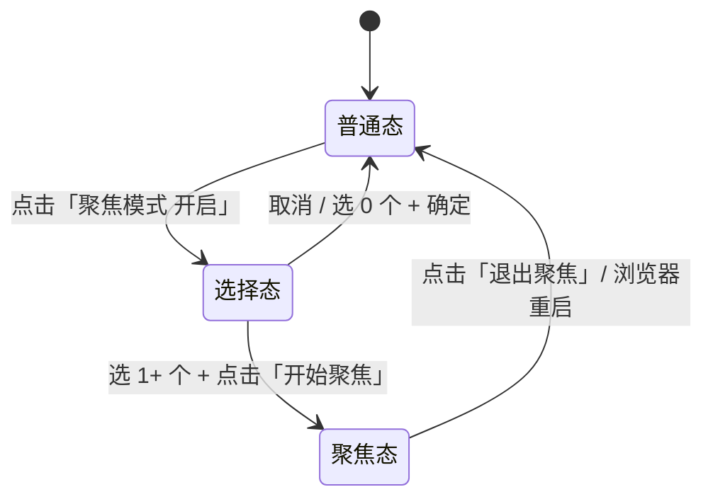

# 聚焦模式（Focus Mode）

> Status: Draft v3 · Author: product-manager (主 Claude 代行) · Date: 2026-06-27 · Feature slug: `focus-mode`
>
> **v3 变更**（2026-06-27）：
> - 技术方案从 chrome.tabs.hide（实验API，不可用）改为 chrome.tabGroups 折叠（稳定API Chrome 89+）
> - 删除 FocusUpgradeDialog 和浏览器版本降级逻辑
> - 简化聚焦态 UI（不需要蒙层假装隐藏，标签实际已被浏览器分组折叠）
> - 新增 tabGroups 方案特有的 6 条边界用例
>
> **v2 变更**（基于用户 review）：
> - §4.4 聚焦态 UI 改为**蒙层方案**（原方案逐个置灰控件 → 现一层蒙层覆盖原 UI，只露出聚焦三区块）
> - §4.5 问号气泡补全所有系统行为说明（让用户提前知道边界）
> - §4.6 每条边界行为补充 toast 提示文案
> - §7.4 新增版本兼容降级策略（feature detect + 引导升级，不强制提版本）

---

## 1. 背景与目标

### 现状/痛点
用户开 50+ 浏览器标签，但**真正在用的只有 4-5 个**（写代码 + 文档 + 沟通工具 + 测试页）。痛点：
- 标签栏拥挤，favicon 都被压成一个点，**视觉上找不到自己要的那一个**
- Cmd+1~9 失效（标签太多挤出可访问范围）
- 想关掉无关标签又不舍得——"等下可能还要查"
- 现有 Chrome 原生标签分组只折叠不隐藏，标签栏仍然占满

竞品（OneTab / Workona / Tab Suspender）的"工作空间"思路接近，但都偏重**长期归档**，不解决"我就专注接下来 30 分钟"的临时聚焦需求。

### 目标
让用户在**当前会话**临时把视野收窄到 4-5 个标签，其他标签**从标签栏折叠隐藏**，复用 Chrome `chrome.tabGroups` API。结束后一键恢复。

### 非目标（详见 §9）
不做多预设、不做跨会话持久化、不做云端同步、不做时长统计。

### 成功指标
- 进入/退出聚焦模式的总操作步数 ≤ 4 步（含选择 4 个标签的 4 次点击）
- 进入后 200ms 内标签栏完成折叠
- 用户在聚焦模式下平均停留时长 ≥ 15 分钟（埋点确认这是真"聚焦"而非误触）

---

## 2. 用户场景与故事

### 用户画像
- **效率重度用户**：开发 / 设计 / 文档协作场景，长期标签数 30+
- **会话频次**：每天进入聚焦模式 2-5 次，每次 15min ~ 2h
- **触发情境**：开始一个明确任务时（修 bug、写需求文档、面试准备）

### User Story
- **US-1**：作为重度用户，我想从一堆标签里挑出几个当前要用的，让浏览器只显示它们，以便排除视觉干扰
- **US-2**：作为搜索型用户，我想用关键词快速过滤出要聚焦的标签（如搜 "PR" 找出今天要 review 的 4 个 PR），以便不用人眼扫
- **US-3**：作为整理型用户，我想按域名/打开时间排序后再勾选，以便按"项目"或"最近"维度组织聚焦
- **US-4**：作为聚焦中的用户，我想看到清晰的"我在聚焦"标识，且**不能误操作其他功能**，以便心无旁骛
- **US-5**：作为退出用户，我想一键恢复所有标签，并立即回到聚焦前的样子

### 关键路径（最长）
```
用户打开 sidepanel
  → 看到 50 个标签
  → 点击 Header 的「聚焦模式 开启」按钮（原"聚焦"按钮文案更新）
  → 进入「选择聚焦标签」状态：sidepanel 多选模式 + 顶部蓝色进度提示
  → 通过 [搜索框 / 排序 / 滚动浏览 / 标记筛选] 任意组合找到要聚焦的标签
  → 点选 4-5 个（多选）
  → 点击「开始聚焦 (4)」按钮
  → chrome.tabGroups 将其余 46 个折叠进灰色分组 → 标签栏只剩 4 个聚焦标签 + 1 个折叠分组
  → sidepanel 进入"聚焦中"状态：只显示 4 个聚焦标签，顶部状态提示 + 退出按钮
  → 工作 30 分钟……
  → 点击「退出聚焦」
  → chrome.tabs.ungroup() 恢复全部 → 回到选择前的 sidepanel 状态
```

---

## 3. 竞品参考

| 产品 | 同类功能 | 实现深度 | 值得学的 | 要避开的 |
|---|---|---|---|---|
| **OneTab** | 把多个 tab 折叠成一个列表页 | 极重——所有非聚焦 tab 被关闭并保存到一个新 tab 的列表里，要恢复得一个个点 | 列表化的恢复界面 | 关闭再恢复破坏 tab 状态（表单输入丢失、登录态丢失） |
| **Workona** | 跨"工作空间"切换 | 长期归档导向，工作空间有名字、跨设备同步 | "空间" mental model 清晰 | 重，需要登录账号，学习成本高 |
| **Tab Suspender** | 自动挂起非活跃 tab 释放内存 | 不隐藏标签，只挂起 | 内存优化思路 | 不解决视觉拥挤问题 |
| **Arc Browser - Air Traffic Control** | 给标签加自动分类规则 | 持续运行，自动整理 | 规则化思路 | 自动化容易出错，用户不可控 |
| **Chrome 原生 Tab Groups** | 折叠分组 | 仅折叠标签栏可视空间，不真正消失 | 颜色标识 + 命名 | 折叠后仍可见，绕过聚焦 |

### 差异化定位
**没有竞品做"临时短时聚焦"**——都偏长期归档或自动化。我们的切入点：
- **一次性**：每次都是临时选择，无持久状态管理负担
- **真折叠**：用 `tabGroups` 比手动折叠更彻底，一键完成
- **0 数据丢失**：标签不被关闭，只是折叠进分组，状态完全保留
- **轻量入口**：Header 一个按钮 + 一次多选 = 进入

---

## 4. 交互设计

### 4.1 入口改造
当前 sidepanel Header 有「聚焦」按钮。改造为：

```
[聚焦模式 开启]  (?)         ← 默认态
[聚焦模式 关闭]  (?)         ← 聚焦中态
```

- 按钮文案明确"开启/关闭"，让用户一眼懂这是个开关而不是动作
- 旁边小问号 `(?)` 图标 → 点击弹出气泡说明（见 §4.5）

### 4.2 三态流程图



### 4.3 选择态 UI

布局（在现有 sidepanel 之上叠加引导层）：

```
┌─────────────────────────────────────┐
│ Header（聚焦按钮变成"取消"）           │
├─────────────────────────────────────┤
│ ⚡ 选择要聚焦的标签 · 已选 3 / 建议 4-5  │  ← 蓝色进度条 banner
│ ┌─────────────────────────────────┐│
│ │ 🔍 搜索过滤要聚焦的标签...        ││  ← 搜索框（复用现有）
│ └─────────────────────────────────┘│
├─────────────────────────────────────┤
│ ☑ 标签1（已选）                      │
│ ☑ 标签2（已选）                      │
│ ☐ 标签3                            │
│ ☑ 标签4（已选）                      │
│ ☐ 标签5                            │
│ ...                                │
├─────────────────────────────────────┤
│  [取消]              [开始聚焦 (3)]  │  ← 底部固定操作栏
└─────────────────────────────────────┘
```

**关键交互**：
- 直接复用现有的"批量选择"模式（已有 `isBatchMode` 状态）
- 搜索框、排序、标签筛选、滚动浏览均可用（即 §2 US-2/US-3 的"任意组合"）
- 选 0 个时"开始聚焦"按钮置灰
- 已选数量 > 7 时 banner 提示"标签过多可能影响聚焦效果"（不阻断）
- 取消按钮 = 退出选择态，**不影响原有标签状态**

### 4.4 聚焦态 UI（**简化方案，无需蒙层**）

**核心理念**：标签实际已被浏览器分组折叠，不需要假装隐藏。sidepanel 只显示聚焦集合内的标签，顶部状态提示 + 退出按钮。

```
┌─────────────────────────────────────┐
│ Header（聚焦按钮变成"关闭"）          │
├─────────────────────────────────────┤
│ ⚡ 聚焦中 · 4 个标签 · 已折叠 46 个   │  ← 琥珀色 banner
├─────────────────────────────────────┤
│ 📌 标签1（已激活）                   │  ← 聚焦标签卡片（可点击激活、可关闭）
│ 📌 标签2                            │
│ 📌 标签3                            │
│ 📌 标签4                            │
├─────────────────────────────────────┤
│  ←  退出聚焦模式                     │  ← 红色横条按钮（永远固定在底部）
└─────────────────────────────────────┘
```

**聚焦态显示规则**：
- sidepanel **只显示聚焦集合内的标签**，其他标签通过 `chrome.tabs.query` 过滤掉
- 固定标签（pinned tabs）**强制包含在聚焦集合内**（Chrome API 限制无法放进 tabGroup）
- 卡片操作：只保留激活（点击）和关闭（右侧 X 按钮），其他操作（更多/标记/稍后/复制）**全部隐藏不渲染**——聚焦态下不需要分心

**视觉过渡**：进入/退出聚焦态用 200ms fade 过渡，避免突兀。

### 4.5 问号气泡内容

点击 `(?)` 弹出小气泡（不是模态弹框，避免打断流程）。**关键：把系统的所有自动行为提前告诉用户，建立准确预期**：

```
┌──────────────────────────────────────────┐
│  聚焦模式                                  │
│                                           │
│  开启后：浏览器只显示你选中的 4-5 个关键   │
│  标签，其他标签折叠进灰色分组。            │
│                                           │
│  ── 系统行为（提前知道才不慌） ──          │
│  · 标签不会关闭，数据和登录态完全保留      │
│  · 固定标签会自动包含在聚焦集合内          │
│  · 聚焦中新开的标签会自动加入聚焦集合       │
│  · 聚焦中关闭最后一个标签 → 自动退出        │
│  · 关闭浏览器 → 自动退出聚焦（分组保留）    │
│  · chrome:// 等系统页面无法被折叠          │
│                                           │
│  ── 适合场景 ──                           │
│  · 需要专注的 30 分钟 ~ 2 小时             │
│  · 写代码 / 写文档 / 准备演讲 / 面试       │
│                                           │
│  操作：勾选要聚焦的标签 → 一键折叠其他     │
└──────────────────────────────────────────┘
```

### 4.6 边界状态与 Toast 提示

每条系统自动行为都伴随一条 toast（已在 §4.5 气泡中预告，行为发生时再次确认），让用户始终知道"发生了什么、为什么发生"：

| 场景 | 系统行为 | Toast 提示文案 | 提示时长 |
|---|---|---|---|
| 选 0 个标签直接确定 | "开始聚焦"按钮置灰，无法点击 | — （视觉已表达） | — |
| 选中标签里**不含当前激活标签** | 进入聚焦后自动激活第一个选中标签 | "已切换到聚焦标签：《xxx》" | 2s |
| 选中的全是 pinned 标签 | 允许进入聚焦 | "固定标签本来就不会被折叠，本次聚焦实际未折叠任何标签" | 3s |
| 聚焦中**手动新开**一个标签 | 新标签**自动加入聚焦集合**，不被折叠 | "新标签已加入聚焦：《xxx》" | 2s |
| 聚焦中**关闭**一个聚焦标签 | 从聚焦集合移除，sidepanel 减少一项 | "已关闭，聚焦中还剩 N 个标签" | 1.5s |
| 聚焦中关闭**最后一个**聚焦标签 | 自动退出聚焦，恢复所有标签 | "所有聚焦标签已关闭，已退出聚焦模式" | 3s |
| 浏览器重启后再打开 sidepanel | 检测到聚焦状态丢失（storage.session 已清） | "聚焦状态已重置（浏览器重启）" | 3s |
| 选择态：存在 chrome:// 等受限标签 | 选择列表中**直接过滤掉**这些标签 | 选择态顶部静态提示："系统页面（chrome://、edge://）不可被折叠，已自动排除 N 个" | 常驻 |
| 选 > 7 个标签 | 允许选择，但提示建议数 | "建议聚焦 4-7 个标签，效果更好" | 2.5s |
| 浏览器版本不支持 chrome.storage.session（< Chrome 102） | 「聚焦模式 开启」按钮置灰 | hover tooltip："聚焦模式需要 Chrome 102+ 或 Edge 102+，请升级浏览器" | 常驻 tooltip |
| **聚焦中用户手动展开了灰色分组** | 监听 `tabGroups.onUpdated`，检测到 collapsed 被改成 false 时**自动重新折叠** | "已重新折叠非聚焦标签，保持专注" | 2s |
| **聚焦中用户手动从灰色分组激活标签** | 将该标签从灰色分组移除、加入聚焦集合 | "标签已加入聚焦：《xxx》" | 2s |
| **聚焦中用户手动关闭灰色分组里的标签** | 不影响聚焦态，同步状态即可 | —（无提示） | — |
| **聚焦中用户创建了新分组** | 不影响"已隐藏"灰色分组 | —（无提示） | — |

### 4.7 引导
- **首次开启**（chrome.storage.local 无 `focusModeShown` 标志）：选择态 banner 下方多一行教学文字"💡 用搜索、排序快速找到要聚焦的标签，勾选后点底部按钮"
- 之后不再显示

---

## 5. 数据模型

### 5.1 前端 chrome.storage.session（用 session 而非 local，自动随浏览器关闭清空，符合"不持久化"）

```typescript
interface FocusState {
  active: boolean              // 是否处于聚焦态
  focusedTabIds: number[]      // 聚焦的 tab id（顺序 = 用户选择顺序）
  hiddenGroupId: number        // "已隐藏"灰色分组的 groupId（用于退出时精确恢复）
  enteredAt: string            // 进入聚焦的 ISO 时间戳（用于埋点 / banner 显示时长）
}
```

### 5.2 前端 chrome.storage.local（持久标志）

```typescript
{
  focusModeShown: boolean      // 是否看过首次引导
  focusUsageCount: number      // 累计使用次数（埋点，可选）
}
```

### 5.3 持久化策略
- `FocusState` 进 session storage：浏览器关闭即清，符合 §1 "不持久化" 决策
- 进入聚焦时写入 `FocusState.active = true` 等字段
- 退出时清空（写空对象或调用 storage.session.remove）

---

## 6. 接口契约

**本期无后端**。所有交互通过 chrome.* API：

| 调用 | 时机 | 输入 | 输出 |
|---|---|---|---|
| `chrome.tabs.group({ createProperties: { windowId }, tabIds })` | 用户点击"开始聚焦" | 非聚焦的 tab id 数组 | Promise<number>（groupId） |
| `chrome.tabGroups.update(groupId, { collapsed: true, color: 'grey', title: '🌙 已隐藏' })` | 创建分组后 | groupId + 分组配置 | Promise<TabGroup> |
| `chrome.tabs.ungroup(tabIds)` | 用户点击"退出聚焦" | 原分组内的所有 tab id | Promise<void> |
| `chrome.tabs.update(focusedId, {active: true})` | 进入聚焦时若当前激活不在聚焦集 | tab id | Promise<Tab> |
| `chrome.storage.session.set/get` | 状态持久化 | `FocusState` 对象 | Promise<void> |
| `chrome.storage.local.set/get` | 引导标志读写 | `focusModeShown` | Promise<void> |

**未来云同步预留**：将来如需把"聚焦预设"同步到云端（详见 §10），接口约定预留：
- `POST /api/focus/presets` — 保存聚焦预设
- `GET /api/focus/presets` — 拉取用户预设
- 字段：`name` / `tabUrls[]` / `createdAt` / `updatedAt`

但**本期不实现**。

---

## 7. 性能 / 安全 / 兼容

### 7.1 性能预算
- 进入聚焦的总耗时（点按钮 → 标签栏更新完）：< 200ms（含 chrome.tabs.group 批量调用）
- 退出聚焦：< 150ms
- 选择态 50 个标签滚动 60fps（复用现有视图，应无问题）
- 聚焦态 banner 时长显示用 CSS 渲染，不开 setInterval

### 7.2 安全
- 无新增网络请求、无新增 manifest 权限
- 复用 `tabs` 权限（已有）
- 不存储 URL 内容（只存 id），避免隐私泄漏

### 7.3 兼容

- 目标矩阵：Chrome 102+ / Edge 102+ × macOS / Windows（按 `constraint-target-platforms` memory）
- `chrome.tabGroups` API：Chrome 89+ / Edge 89+ 可用 ✓
- `chrome.storage.session`：Chrome 102+ / Edge 102+ 可用 — **这是实际下限**

### 7.4 版本兼容策略（简化版）

**Feature detect，不读 UserAgent**（更可靠且不受厂商伪装影响）：

```javascript
// 检测点：核心 API 是否可用
const SUPPORTS_FOCUS_MODE = typeof chrome?.storage?.session?.set === 'function'
                          && typeof chrome?.tabGroups?.update === 'function'
```

**降级行为**：
- `SUPPORTS_FOCUS_MODE === true` → 聚焦模式正常工作
- `SUPPORTS_FOCUS_MODE === false`（旧版本浏览器）→
  - 「聚焦模式 开启」按钮**置灰但保留显示**（让用户知道有这个功能）
  - hover 提示：「聚焦模式需要 Chrome 102+ 或 Edge 102+，当前版本不支持，请升级浏览器」

**其他功能不受影响**：版本不支持时，sidepanel 的其他所有功能（标签列表、搜索、稍后处理、标记等）正常工作——只屏蔽聚焦入口。

---

## 8. 验收标准

### 功能验收
- [ ] Header 的"聚焦"按钮文案改为"聚焦模式 开启"/"聚焦模式 关闭"
- [ ] 按钮旁有问号图标，点击弹出气泡（含 §4.5 完整文案，明确告知所有系统自动行为）
- [ ] 浏览器版本不支持时按钮置灰 + hover tooltip
- [ ] 点击开启 → 进入选择态，可通过搜索/排序/滚动选择标签
- [ ] 选择态自动过滤 chrome:// 等受限标签，顶部静态提示已排除数量
- [ ] 选择态底部按钮显示已选数量，0 个时禁用
- [ ] 选择态可以取消，取消后回到普通态，不影响标签
- [ ] 点击"开始聚焦"→ chrome.tabs.group 成功创建灰色分组"🌙 已隐藏"并折叠
- [ ] 聚焦态 sidepanel 只显示聚焦集合内的标签（含固定标签）
- [ ] 聚焦态顶部琥珀色 banner、底部红色"退出聚焦"按钮均显示
- [ ] 聚焦态卡片只保留激活和关闭，其他操作（更多/标记/稍后/复制）不渲染
- [ ] 进入/退出聚焦态有 200ms fade 过渡
- [ ] 点击"退出聚焦" → 所有标签从分组移除，sidepanel 回到普通态
- [ ] **tabGroups 特有边界**：
  - [ ] 固定标签强制包含在聚焦集合内，不进灰色分组
  - [ ] 聚焦中手动展开灰色分组 → 自动重新折叠 + toast 提示
  - [ ] 聚焦中手动从灰色分组激活标签 → 加入聚焦集合 + toast 提示
  - [ ] 聚焦中手动关闭灰色分组里的标签 → 不影响聚焦态
  - [ ] 聚焦中创建新分组 → 不影响"已隐藏"灰色分组
  - [ ] 浏览器重启 → 聚焦状态清除，但灰色分组保留在原地
- [ ] 边界行为发生时均有对应 toast 提示（§4.6 文案对照逐条验证）

### 性能验收
- [ ] 进入聚焦 ≤ 200ms（50 标签场景）
- [ ] 退出聚焦 ≤ 150ms
- [ ] 选择态滚动 60fps

### 兼容验收
- [ ] Chrome 102+ × macOS Sonoma 通过
- [ ] Chrome 102+ × Windows 10/11 通过
- [ ] Edge 102+ × macOS / Windows 通过

---

## 9. Non-Goals（明确不做）

- ❌ **多个聚焦预设管理**（如"工作模式"、"研究模式"）— 增加状态管理复杂度，MVP 验证完再说
- ❌ **跨会话持久化** — 重启浏览器后自动失效，符合"聚焦是临时动作"的产品定位
- ❌ **云同步** — 无账号体系
- ❌ **聚焦时长统计 / 番茄钟** — 偏离核心场景
- ❌ **自动聚焦建议**（如"最近 1 小时活跃的 5 个标签自动作为聚焦"）— 自动化容易踩雷
- ❌ **聚焦时屏蔽通知 / 全屏 / 锁定输入** — 超出标签管理边界
- ❌ **后端接口** — 本期纯前端

---

## 10. 风险与未决问题

### 已知风险

| 风险 | 影响 | 缓解 |
|---|---|---|---|
| Chrome `tabGroups` 重启后分组保留 | 用户预期"我把这些标签藏起来明天接着用"会破灭 | §4.5 气泡明确告知"关闭浏览器自动退出聚焦"；§4.6 重启后 toast 提示 |
| `chrome.storage.session` 需要 Chrome 102+ | 89-101 用户用不了 | Feature detect 降级策略 — 不支持时按钮置灰，其他功能正常 |
| 聚焦中用户手动展开灰色分组 | 破坏聚焦体验 | §4.6 已定义：监听 `tabGroups.onUpdated`，发现 collapsed 变化 → 自动重新折叠 + toast 提示 |
| 聚焦的标签 URL 是受限页面（chrome://、edge://） | group API 对部分 URL 返回错误 | 选择态过滤掉 `isProtected` 标签（types/tab.ts 已有该字段），且选择列表不显示 |
| 用户用快捷键（Ctrl+T）新开标签 | 新标签不在聚焦集，但按 §4.6 决策自动加入 | 需在 `chrome.tabs.onCreated` 监听器中处理 |
| 50→5 切换瞬间视觉抖动 | 用户体验差 | 选择态 → 聚焦态用 100ms fade transition |
| **固定标签无法放进 tabGroup** | 必须包含在聚焦集合 | §4.6 已定义：强制包含固定标签到聚焦集，toast 提示用户 |

### 未决问题（需要在 v3 review 时确认）

> @TODO: 退出聚焦后，是否要在 sidepanel 顶部显示"刚才聚焦了 N 分钟，关闭了 X 个标签"摘要？还是直接回到普通态？
> @TODO: 是否需要快捷键开启聚焦（如 Cmd+Shift+F）？本期不做，但需要预留 keymap 不冲突。
> @TODO: 聚焦中的卡片样式是否需要差异化（如更大字、更明显的 active 高亮）？还是和普通态一致？倾向一致，避免维护两套样式。
> @TODO: 浏览器重启后旧的灰色分组是否需要自动删除？还是留给用户手动处理？

---

## 11. 给下游开发的提示（非 PRD 标准章节，便于 hand-off）

- **复用资产**：
  - `composables/useTabManager.ts` 已有 batch select 能力（`selectedIds` / `toggleSelect`）
  - `sidepanel.vue` 已有 `isFocusMode` ref（CLAUDE.md 进度提到"聚焦模式 Header 按钮已有，逻辑待实现"）— 复用
- **建议新文件**：
  - `composables/useFocusMode.ts` — 聚焦状态管理 + tabGroups 调用 + storage.session 同步 + feature detect
  - `composables/useFocusToast.ts`（或复用现有 showToast）— §4.6 边界 toast 触发器
  - `components/FocusBanner.vue` — 顶部琥珀色提示条（聚焦中 · X 个标签 · 已折叠 Y 个）
  - `components/FocusSelectBar.vue` — 选择态底部"开始聚焦 (N)"操作栏
  - `components/FocusHelpBubble.vue` — 问号气泡（§4.5 完整文案）
- **聚焦态实现要点**（简化方案）：
  - sidepanel 过滤显示聚焦集合内的标签（通过 `chrome.tabs.query` + 对比 `focusedTabIds`）
  - 固定标签（`pinned: true`）强制加入 `focusedTabIds`，不进灰色分组
  - 进入聚焦时：
    1. 获取所有非聚焦、非固定、非受限的标签 id
    2. 调用 `chrome.tabs.group()` 创建分组，获取 `groupId`
    3. 调用 `chrome.tabGroups.update(groupId, { collapsed: true, color: 'grey', title: '🌙 已隐藏' })`
    4. 保存 `groupId` 到 `storage.session`
  - 退出聚焦时：
    1. 从 `storage.session` 读取 `hiddenGroupId`
    2. 调用 `chrome.tabGroups.get(hiddenGroupId)` 获取分组内的 tabIds
    3. 调用 `chrome.tabs.ungroup(tabIds)` 恢复所有标签
  - 监听 `chrome.tabGroups.onUpdated`：检测到灰色分组被展开时自动重新折叠
  - 监听 `chrome.tabs.onActivated`：检测到激活灰色分组内的标签时，将其加入聚焦集
- **manifest 不需要新增权限**：`tabs` 已有，`tabGroups` 不需要额外权限
- **测试关键路径**：
  - 50 标签（含 3 个 pinned）→ 选 4 个 → 聚焦 → 退出（happy path）
  - 聚焦中关闭最后一个 → 自动退出
  - 聚焦中手动新开 → 加入聚焦集
  - 聚焦中手动展开灰色分组 → 自动重新折叠
  - 聚焦中手动从灰色分组激活标签 → 加入聚焦集
  - 浏览器重启 → 聚焦状态丢失但不报错

---

> **下一步**：用户 review 后，主调度会启动 `extension-frontend` 实现。本 PRD 任何字段变更必须先回此文件改完再开工。
