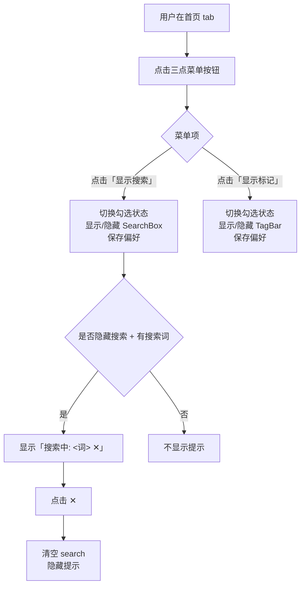

# 首页工具栏显示/隐藏功能 PRD

> Status: Draft · Author: plugs-pm · Date: 2026-07-13（修订）

---

## 1. 背景与目标

### 1.1 现状与痛点

插件首页（侧边栏的首页 tab）顶部目前有两个区域占用垂直空间：
1. **搜索框**（SearchBox）：高度约 40px，含边框和间距
2. **标记栏**（TagBar）：高度约 36px（无标记时）或更高（有标记时，最多 3 行约 108px）

两者合计占用约 **76-148px** 的垂直空间，这在屏幕空间宝贵的侧边栏（通常宽度仅 300-400px，高度有限）中是一个不小的比例。

**TagBar 的双重功能**（之前 PRD 漏了）：
- 显示标记并按标记筛选标签（有标记时）
- 提供「添加/管理标记」的入口（空状态有「添加标记来分类标签」按钮，有标记时可通过 chip 管理）

**用户痛点**：
- 当用户不需要搜索或标记功能时，这些区域仍然占用空间，导致标签列表可显示数量减少
- 用户需要更多滚动才能查看标签，降低效率
- 小屏幕笔记本上尤为明显
- **若整体收起，会导致「新建/管理标记」入口不可达**

### 1.2 目标
- 让用户能分别独立控制搜索框和标记栏的显示/隐藏
- 隐藏搜索框但有搜索词时，保持搜索过滤并显示可感知的提示
- 记忆用户偏好，下次打开扩展时保持状态
- 不影响「新建/管理标记」入口的可访问性（即使隐藏标记栏，仍可通过右键菜单打标）

### 1.3 Non-Goals（非目标）
- 不实现整体收起/展开（改为分别控制）
- 不改变搜索框和标记栏本身的功能和样式
- 不做复杂动画（仅简单过渡效果）
- 不影响其他 tab（稍后/分组/历史）的布局

---

## 2. 用户场景与故事

### 2.1 用户画像
- **角色**：经常打开很多标签页的高级用户
- **频次**：每天使用插件多次
- **触发情境**：
  1. 查看标签列表时，觉得搜索框或标记栏占用太多空间
  2. 搜索完标签后，不需要搜索框了，想把它藏起来，但保留标记栏
  3. 不需要使用标记功能时，想把标记栏藏起来，但保留搜索框

### 2.2 User Story 列表
1. **作为用户**，我想通过三点菜单分别控制搜索框和标记栏的显示/隐藏，**以便**灵活释放屏幕空间
2. **作为用户**，我希望隐藏搜索框但有搜索词时能看到提示，**以便**知道标签为什么被过滤
3. **作为用户**，我希望我的显示/隐藏偏好被记住，**以便**下次打开插件时保持我的习惯
4. **作为用户**，我希望即使隐藏了标记栏，仍能通过右键菜单给单个标签打标，**以便**标记功能不受影响

### 2.3 关键路径
1. **隐藏路径**：用户在首页 tab 看到三点菜单 → 点击打开 → 取消「显示搜索」或「显示标记」 → 对应区域隐藏 → 菜单保持勾选状态同步
2. **显示路径**：用户在首页 tab 看到三点菜单 → 点击打开 → 勾选「显示搜索」或「显示标记」 → 对应区域显示
3. **搜索提示路径**：用户隐藏搜索框但有搜索词 → 看到「搜索中: <词> ✕」提示 → 点击 ✕ 清除搜索

---

## 3. 竞品参考（已修订）

### 3.1 常见显示/隐藏模式
- **Chrome 书签栏**：右键菜单勾选「显示书签栏」，可分别控制
- **VS Code 侧边栏面板**：三点菜单勾选显示/隐藏各个面板
- **Office 功能区**：右键菜单勾选显示/隐藏各个选项卡

### 3.2 我们的选择（用户决策）
采用 **方向 B（三点菜单分别控制）**，不采用方向 A（箭头整体收起）。

**核心理由**（用户审查发现）：
1. **避免功能入口丢失**：TagBar 是「按标记筛选 + 添加/管理标记入口」二合一，整体收起会让「新建/管理标记」入口不可达；分别控制可只藏一个、保留另一个
2. **更灵活**：用户可只隐藏搜索框保留标记栏，或反之
3. **符合心智**：勾选菜单是控制显示/隐藏的常见模式，用户容易理解

---

## 4. 交互设计（已修订）

### 4.1 信息架构
- **入口位置**：首页 tab 栏的最右侧
- **入口样式**：`MoreHorizontal`（三点菜单）图标
- **菜单内容**：
  - `☑ 显示搜索`（默认勾选，控制 SearchBox 显示/隐藏）
  - `☑ 显示标记`（默认勾选，控制 TagBar 显示/隐藏）
- **状态同步**：菜单项勾选状态与实际区域显示状态实时同步
- **新增提示区**：当 `!homeSearchVisible && search.trim()` 时，在 nav tabs 下方显示「搜索中: <词> ✕」

### 4.2 可复用组件确认
- **可复用**：`usePopoverManager`（已在项目中广泛使用）+ `Teleport` + `fixed` 定位的下拉菜单模式
- **标杆参照 1**：`components/AppToolbar.vue` line 32-74（视图/排序/整理下拉菜单）
- **标杆参照 2**：`components/GroupItem.vue` line 18-56（三点菜单 + Teleport + 菜单项）
- **图标确认**：`MoreHorizontal` 已在 `components/GroupItem.vue` 中使用（line 23），无需新增

### 4.3 关键画面草图（已修订）
```
┌─────────────────────────────────┐
│ 标签大师              [设置] │  ← Header
├─────────────────────────────────┤
│ [首页] [稍后] [分组] [历史] [⋮] │  ← Nav Tabs + 三点菜单
├─────────────────────────────────┤
│ [搜索标签、URL...]           │  ← SearchBox（显示搜索 勾选时）
├─────────────────────────────────┤
│ 标记: [多选] [全部] [工作] ... │  ← TagBar（显示标记 勾选时）
├─────────────────────────────────┤
│ [视图] [排序] [整理] [...]   │  ← AppToolbar（始终显示）
├─────────────────────────────────┤
│ [Pinned Bar]                  │
├─────────────────────────────────┤
│ 标签列表...                  │
│ ...                         │
└─────────────────────────────────┘

菜单打开时：
┌─────────────────────────────────┐
│ [首页] [稍后] [分组] [历史] [⋮] │
├─────────────────────────────────┴───────┐
│ ☑ 显示搜索                     │ ← 下拉菜单
│ ☑ 显示标记                     │
├─────────────────────────────────────────┤
│ ...                                     │

隐藏搜索框但有搜索词时：
┌─────────────────────────────────┐
│ 标签大师              [设置] │
├─────────────────────────────────┤
│ [首页] [稍后] [分组] [历史] [⋮] │
├─────────────────────────────────┤
│ 搜索中: 工作 ✕             │ ← 搜索提示（新增）
├─────────────────────────────────┤
│ 标记: [多选] [全部] [工作] ... │
├─────────────────────────────────┤
│ [视图] [排序] [整理] [...]   │
├─────────────────────────────────┤
│ 标签列表（仅含「工作」标签）   │
│ ...                         │
└─────────────────────────────────┘
```

### 4.4 交互流程（已修订）


### 4.5 边界状态（已修订）
- **空状态**：无标记时，「显示标记」选项仍然可用（此时隐藏的是空状态的 TagBar）
- **聚焦选择态**：三点菜单按钮隐藏（聚焦模式有自己的 Header）
- **搜索隐藏但有搜索词**：
  - 列表仍被搜索词过滤
  - 在 nav tabs 下方显示「搜索中: <词> ✕」提示
  - 点击 ✕ 清空搜索并隐藏提示
- **其他 tab**：在"稍后/分组/历史"tab 时，三点菜单按钮隐藏（只有首页需要）
- **标记隐藏但仍可打标**：即使隐藏了 TagBar，用户仍可通过右键菜单给单个标签打标（不影响现有标记功能）

### 4.6 引导/教育
- 鼠标悬停在三点菜单按钮上时，tooltip 提示："显示选项"
- 菜单项文案明确：「显示搜索」「显示标记」
- 不做问号提示（功能简单，不需要额外解释）

### 4.7 可感知设计（必填，已修订）

#### 4.7.1 按钮/图标/菜单
- **入口按钮**：
  - 图标：`MoreHorizontal`（三点菜单）
  - tooltip："显示选项"
  - 样式：参照 `GroupItem.vue` line 20-24
- **下拉菜单**：
  - 样式：参照 `AppToolbar.vue` line 79-118
  - 菜单项：勾选框 + 文字，参照常见勾选菜单
  - 勾选状态：与实际区域显示状态同步
- **搜索提示区**：
  - 显示条件：`!homeSearchVisible && search.trim()`
  - 位置：nav tabs 下方、AppToolbar 上方
  - 样式：参照 `TagBar.vue` line 76-109 的 chip 样式（圆角、内边距、字号）
  - 内容：`搜索中: <关键词> ✕`
  - ✕ 按钮：点击后 `search = ''`，提示区隐藏

#### 4.7.2 事中反馈
- 点击三点菜单按钮后，下拉菜单立即弹出
- 点击菜单项后，勾选状态立即切换，对应区域立即显示/隐藏
- 隐藏搜索框但有搜索词时，提示区立即显示
- 不需要 loading 状态（操作很快）

#### 4.7.3 事后提示
- 不需要 toast 提示（状态变化明显，用户能直接看到）
- 用户偏好自动保存，下次打开时保持状态

#### 4.7.4 可逆性
- 显示/隐藏可以随时切换，反之亦然
- 搜索提示区的 ✕ 可以随时清除搜索
- 没有不可逆的操作

### 4.8 数据一致性（必填）
- **显示/隐藏状态**：作为用户设置的一部分，存储在 `chrome.storage.local.tabMasterSettings` 中
- **两个独立字段**：
  - `homeSearchVisible: boolean`（搜索框是否显示）
  - `homeTagBarVisible: boolean`（标记栏是否显示）
- **读取时机**：插件启动时从 storage 读取，应用到 UI
- **不受筛选污染**：这些状态是独立的，不受搜索/筛选的影响
- **跨窗口**：状态在当前窗口生效，不影响其他窗口

---

## 5. 数据模型（已修订）

### 5.1 实体定义
在 `types/settings.ts` 的 `TabMasterSettings` 接口中新增：
```typescript
export interface TabMasterSettings {
  // ... 现有字段
  homeSearchVisible: boolean    // 首页搜索框是否显示，默认 true
  homeTagBarVisible: boolean    // 首页标记栏是否显示，默认 true
}
```

### 5.2 默认值
在 `DEFAULT_SETTINGS` 中新增：
```typescript
export const DEFAULT_SETTINGS: TabMasterSettings = {
  // ... 现有字段
  homeSearchVisible: true,      // 默认显示搜索框
  homeTagBarVisible: true,      // 默认显示标记栏
}
```

### 5.3 持久化位置
- 存储在 `chrome.storage.local.tabMasterSettings` 中
- 使用现有 `useSettings.ts` 的机制，无需额外代码
- 写入 reactive 数据时使用 `toPure()`（遵循现有约定）
- `mergeSettings` 兼容旧数据：旧数据没有这两个字段时，默认设为 `true`

---

## 6. 接口契约（前后端协作时必填）
- 无后端接口需求，纯前端功能

---

## 7. 性能/安全/兼容

### 7.1 性能
- **首屏渲染**：不影响，只是读取两个 boolean 值
- **操作响应**：点击按钮立即响应，无延迟
- **内存**：不增加明显内存占用

### 7.2 安全
- 不涉及权限变更
- 不处理敏感数据
- 遵循现有 CSP 策略

### 7.3 兼容
- **目标浏览器**：Chrome 100+、Edge 100+（与插件现有要求一致）
- **平台**：Windows、macOS（与插件现有要求一致）
- **暗色模式**：自动适配（使用现有 CSS 变量）

---

## 8. 验收标准（已修订）

### 8.1 功能验收
- [ ] 首页 tab 栏最右侧有一个三点菜单按钮，图标为 `MoreHorizontal`
- [ ] 点击三点菜单按钮，弹出下拉菜单，含两个勾选项：「显示搜索」「显示标记」，默认都勾选
- [ ] 取消「显示搜索」勾选，搜索框隐藏；重新勾选，搜索框显示
- [ ] 取消「显示标记」勾选，标记栏隐藏；重新勾选，标记栏显示
- [ ] 搜索框隐藏但 `search.trim()` 非空时，在 nav tabs 下方显示「搜索中: <词> ✕」提示
- [ ] 点击提示区的 ✕，`search` 清空，提示区隐藏
- [ ] 隐藏标记栏后，仍可通过右键菜单给单个标签打标（不影响现有标记功能）
- [ ] 显示/隐藏状态持久化：刷新扩展/重启浏览器后保持上次选择
- [ ] 只在首页 tab 显示三点菜单按钮，其他 tab（稍后/分组/历史）不显示
- [ ] 聚焦模式下，三点菜单按钮隐藏
- [ ] AppToolbar 在搜索框/标记栏隐藏时上移，间距合理
- [ ] 鼠标悬停在三点菜单按钮上时，tooltip 提示「显示选项」

### 8.2 兼容性验收
- [ ] Chrome 浏览器正常工作
- [ ] Edge 浏览器正常工作
- [ ] Windows 正常工作
- [ ] macOS 正常工作
- [ ] 暗色模式正常显示

### 8.3 鲁棒性验收
- [ ] 操作时不报错，不触发 ErrorBoundary
- [ ] 快速多次点击菜单项，状态正确切换
- [ ] 与现有功能（搜索、标记、排序等）无冲突

---

## 9. Non-Goals（明确不做，已修订）

1. ❌ 不实现整体收起/展开（改为分别控制）
2. ❌ 不做复杂动画（仅简单过渡效果）
3. ❌ 不做快捷键支持（后续可考虑，但 MVP 不需要）
4. ❌ 不影响其他 tab（稍后/分组/历史）的布局
5. ❌ 不改变搜索框和标记栏本身的功能和样式
6. ❌ 不做首次使用引导（功能简单，tooltip 足够）

---

## 10. 风险与未决问题（已修订）

### 10.1 已知风险
- **风险**：用户隐藏标记栏后忘记如何重新显示，导致标记功能不可用
  - **缓解**：三点菜单位置明显，菜单项文案明确（「显示标记」），用户很容易理解
  - **额外缓解**：即使隐藏了标记栏，仍可通过右键菜单给单个标签打标
- **风险**：用户隐藏搜索框但有搜索词时，可能忘记是因为搜索导致标签变少
  - **缓解**：显示「搜索中: <词> ✕」提示，明确告知用户当前状态，并提供快速清除搜索的方式

### 10.2 未决问题（后续迭代）
- 是否需要快捷键支持（如 Ctrl+L 切换搜索框显示）？
- 是否需要在其他 tab 也支持隐藏某些区域？

---

## 11. 给开发 agent（plugs-fe）的交接说明（已修订）

### 11.1 需要修改的文件
根据 `docs/code-map.md`，需要修改：
| 文件 | 修改内容 | 备注 |
|------|----------|------|
| `types/settings.ts` | 新增 `homeSearchVisible`、`homeTagBarVisible` 字段 | 在 `TabMasterSettings` 接口和 `DEFAULT_SETTINGS` 中 |
| `composables/useSettings.ts` | 合并设置时兼容旧数据 | 在 `mergeSettings` 中给旧数据加默认值 `true` |
| `sidepanel.vue` | 新增三点菜单按钮、下拉菜单、搜索提示区、控制逻辑、状态管理 | 修改 nav tabs 区域、SearchBox 和 TagBar 的 v-if 条件 |
| `components/StoragePanel.vue` | 新增两个字段到存储占用统计 | 在 `USER_DEFS` 中新增两项 |

### 11.2 标杆参照
- **三点菜单按钮**：参照 `GroupItem.vue` line 20-24
- **下拉菜单结构**：参照 `AppToolbar.vue` line 79-118 或 `GroupItem.vue` line 25-56
- **勾选菜单项**：参照常见勾选菜单模式（项目中暂无现成勾选菜单，可使用 `✓` 符号或 checkbox）
- **搜索提示区样式**：参照 `TagBar.vue` line 76-109 的 chip 样式
- **设置持久化**：参照 `useSettings.ts` 现有机制
- **Popover 管理**：使用 `usePopoverManager`，参照现有代码

### 11.3 重要：v-if 条件分别叠加
- **SearchBox** 现有条件（`sidepanel.vue:139`）：
  ```vue
  v-if="activeNav === 'home' && (focusMode === 'normal' || focusMode === 'selecting')"
  ```
  改为：
  ```vue
  v-if="activeNav === 'home' && (focusMode === 'normal' || focusMode === 'selecting') && homeSearchVisible"
  ```
- **TagBar** 现有条件（`sidepanel.vue:145`）：
  ```vue
  v-if="activeNav === 'home' && focusMode === 'normal'"
  ```
  改为：
  ```vue
  v-if="activeNav === 'home' && focusMode === 'normal' && homeTagBarVisible"
  ```
  **注意**：两者条件不同，别搞混！

### 11.4 防白屏检查（必填）
修改 `sidepanel.vue` 后，必须做以下检查：
1. [ ] 运行 `compileScript` 检查重复声明、解构重名
2. [ ] 运行 `compileTemplate` 检查模板 TS 断言、复合语句
3. [ ] 运行 `npx vue-tsc --noEmit` 检查类型
4. [ ] 检查顶层 TDZ（`useXxx({ident})` 的 ident 是否在调用前定义）
5. [ ] 检查未定义引用（修改解构后 grep 模板用到的函数是否还在解构里）

### 11.5 注意事项
- 使用现有 `useSettings` 机制，不要自己写 storage 读写
- 写入 reactive 数据时使用 `toPure()`（遵循现有约定）
- 只在 `focusMode === 'normal' && activeNav === 'home'` 时显示三点菜单按钮
- 使用 `usePopoverManager` 管理下拉菜单，id 建议用 `'home-toolbar-options'`
- 搜索提示区使用 `v-if="!homeSearchVisible && search.trim()"`
- 点击提示区的 ✕ 时，设置 `search = ''`
- 不需要修改其他组件（SearchBox、TagBar、AppToolbar 等）
- 确保与聚焦模式、批量选择模式等现有功能无冲突
- 即使隐藏了 TagBar，标记功能仍可通过右键菜单使用（这是现有功能，不需要修改）
