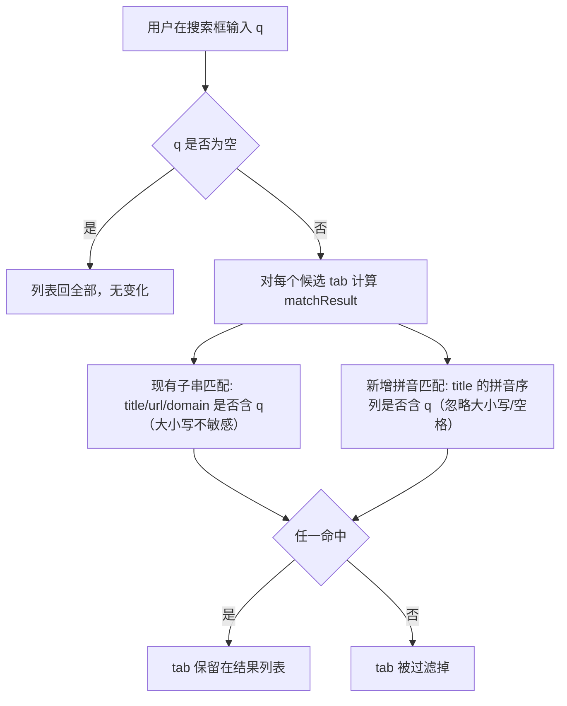

# 标签搜索支持拼音匹配

> Status: Draft · Author: plugs-pm · Date: 2026-07-20

## 1. 背景与目标

### 现状/痛点
- 现有搜索位于 `sidepanel.vue:1485-1487` 的 `matchSearch`，对 `title + url + domain` 三个字段做大小写不敏感的子串匹配。
- 用户痛点：很多网站只记得中文标题（如「实例」），不记得域名；当前输入法在英文态时敲 `shili` 命中不了「实例」，必须切到中文输入法敲出「实例」再切回，来回切输入法打断思路。
- 已有标签列表渲染（`TabListItem.vue` 等四套视图）本就是纯文本渲染标题，**现有搜索对命中关键词没有高亮**——高亮不是既有功能。

### 目标
- 让用户在英文输入法下直接用拼音（全拼 `shili` 或首字母 `sl`）命中含对应汉字的标签标题，省去切输入法。
- 一句话：**在现有搜索上"或"一层拼音命中条件，不改老逻辑、不碰其它功能**。

### 成功指标
- 搜 `shili` 命中标题含「实例」的标签；搜 `sl` 也能命中。
- 现有中文/英文/URL/domain 子串搜索行为零回归（手测一遍既有用例不受影响）。
- 搜索无输入时列表与改动前完全一致（零副作用）。

---

## 2. 用户场景与故事

### 用户画像
- **角色**：浏览器标签大师的侧边栏用户，习惯用顶部搜索框快速定位标签。
- **频次**：高频（每次找标签都用），单次耗时敏感（>300ms 等待即觉卡）。
- **触发情境**：标签多（30+）且包含大量中文标题网站时，只想用拼音快速跳到目标标签。

### User Story
1. 作为侧边栏用户，我想在英文输入法下敲 `shili` 就能命中标题为「实例」的标签，以便不切输入法直接找到。
2. 作为侧边栏用户，我想敲首字母 `sl` 也能命中「实例」，以便更少击键快速过滤。
3. 作为侧边栏用户，我想敲 `shi li`（中间带空格）也能命中，以便我习惯的分词输入不被打断。
4. 作为侧边栏用户，我敲中文「实例」时行为和以前完全一样，以便不产生新认知负担。

### 关键路径
打开侧边栏 → 焦点放搜索框 → 输入 `shili` → 列表实时过滤为"标题拼音含 shili"或"title/url/domain 子串含 shili"的标签 → 点击目标标签切换。

---

## 3. 竞品参考

> 本节基于既有认知描述（网络受限未能实时拉截图），plugs-fe 落地前可二次核实。

- **Workona**：搜索框支持英文子串，对中文标题无拼音匹配，非参考对象。
- **OneTab / Session Buddy**：均无中文拼音匹配，搜索仅英文子串。
- **VSCode Quick Open / IntelliJ Search Everywhere**：对中文项目名支持首字母与全拼匹配（`sl`/`shili` 命中「实例」），是用户已有心智模型来源。
- **差异化**：同类标签管理插件基本都不做拼音，这是面向中文用户的体验增量，非行业基线。

---

## 4. 交互设计

### 信息架构
零新增 UI。完全复用现有搜索框 + 列表过滤结果，不新增面板/按钮/设置项。

### 关键画面
无画面变化。列表过滤结果与现有搜索结果在视觉上一致（命中项正常显示，未命中项被过滤掉）。

### 交互流

### 边界状态
- **空态**：搜索框为空 → 行为与改动前完全一致（`searchPinned/searchOpen/searchClosed` 三个 computed 都在 q 为空时返回 `[]`，列表走 `filteredTabs` 主链路）。
- **加载态**：拼音库加载完成前若用户已开始搜索，按现有逻辑降级（仅子串匹配，拼音条件不命中）——可感知层面无影响，因为子串匹配仍工作，最多少命中几条。
- **错误态**：拼音转换异常（库初始化失败/某字符转换抛错）→ 该 tab 的拼音条件视为 false，不阻断子串匹配，不抛到上层。
- **极限态**：500+ 标签全量拼音转换——需 plugs-fe 评估性能预算（见 §7），必要时缓存转换结果。

### 引导/教育
- 不需要 onboarding。
- 不需要问号说明：拼音匹配是"输入更宽容"的隐性增强，用户感知到"我敲拼音也能搜到"即可，无需显式告知。

### 可感知设计（对照行为准则 §6）
本功能是**搜索过滤的容错扩展**，不引入新用户动作、不改变状态机、无破坏性操作、无不可逆结果。逐条核对：

| 动作 | 事前预期 | 事中反馈 | 事后提示 |
|---|---|---|---|
| 输入拼音 | 搜索框本就接受任意文本，用户预期"输入即过滤" | 列表实时过滤（与现有搜索同样的防抖节奏） | 命中即列表里有；未命中列表为空，沿用现有空态 |
| 命中拼音但未高亮 | 现有搜索本就无高亮，视觉一致 | 无额外反馈 | 无额外提示 |

**结论**：本功能无新增可感知缺口。唯一用户可能产生的疑问是"为什么我搜 shili 命中了实例但标题没高亮"——但既然现有中文搜索也不高亮，整体一致，用户不会单独对拼音命中期待高亮。

### 数据一致性（对照行为准则 §7）
- **派生数据来源**：拼音匹配只读 `tabs.value` / `recentlyClosed.value` 的 `title` 字段做转换，不派生任何新数据，不写 storage。
- **是否受筛选污染**：拼音匹配作用在 `searchPinned/searchOpen/searchClosed` 三个 computed 内，与现有 `matchSearch` 同级，不影响 `filteredTabs` 主链路、不影响 `PinnedBar` 等派生数据。
- **跨窗口标签**：不在本功能范围，拼音匹配只处理当前 `tabs.value` 已加载的列表。
- **chrome 事件兜底**：无需新增监听。`tabs.value` 的更新由现有 `useTabManager` 的 onUpdated/onCreated/onReplaced 等监听维护，搜索 computed 自动响应。
- **搜索结果数量一致性**：拼音是"或"上去的额外命中条件，只会让结果集 ≥ 现有子串匹配，不会让现有命中被误过滤。结果列表与 `tabs.value` 实际状态一致。

---

## 5. 数据模型

零新增持久化数据。零新增 storage key。零新增实体。

**运行时临时数据**（可选，由 plugs-fe 决定是否需要）：
- 为避免每次搜索都对所有 tab 的 title 重复做拼音转换，可在内存里维护一个 `title → 拼音字符串` 的 Map 缓存，随 `tabs.value` 变化增量更新。
- 该缓存纯内存、不写 storage、不跨 session、不进 `StoragePanel.vue`。

---

## 6. 接口契约

无后端接口。本功能完全前端本地实现，不涉及 `api-backend`，不涉及云同步/登录/账号。

---

## 7. 性能/安全/兼容

### 性能预算
- **首屏渲染**：无影响（搜索框未聚焦时列表走原链路）。
- **搜索响应**：单个 tab 的拼音转换应在 1ms 量级；500 标签全量转换应 < 50ms（不阻塞主线程）。若超预算，plugs-fe 需：
  - 增量缓存（title → 拼音），避免每次 keystroke 全量重算；
  - 或在防抖后再做拼音转换（现有搜索防抖节奏不变）。
- **内存上限**：拼音缓存 Map 在 500 标签场景下估算 < 100KB，可接受。

### 安全
- 拼音转换库只在本地处理 `title` 字符串，不接触 cookie/token/敏感数据。
- 不引入 v-html，不改变现有渲染方式，无 XSS 新增面。
- 库的来源：npm 官方源，plugs-fe 落地时核对包名与版本。

### 兼容
- 目标矩阵：Chrome + Edge × macOS + Windows（四端必过）。
- 拼音匹配是纯 JS 字符串处理，不依赖任何浏览器 API，四端行为一致。
- 不改 manifest，不加权限。

### 依赖体积（需用户拍板）
- 候选库 `pinyin-pro`（业内常用，支持全拼/首字母/多音字）：minified 估算约 100KB 量级，gzip 后约 30-40KB 量级（plugs-fe 落地时以 bundlephobia / 实际打包体积为准核实）。
- 对照插件资源带宽红线（部署服务器 2 核 4G 带宽紧张，禁止大依赖）：30-40KB gzip 属可接受范围，但**这是新增依赖**，需用户明确同意。
- 备选思路（无需新依赖）：自带一份精简汉字→拼音映射表，只覆盖常用字。代价是覆盖率和多音字处理弱于专业库，且映射表本身也有体积。**不推荐**——专业库维护成本低、覆盖好。
- 树摇：plugs-fe 落地时按需 import（`pinyin-pro` 支持按具名导出引入，避免整包打入）。

---

## 8. 验收标准

### 功能验收
- [ ] 搜索框输入 `shili`，列表保留标题含「实例」的标签（其它未命中被过滤）。
- [ ] 搜索框输入 `sl`，列表保留标题含「实例」「收纳」「资料」等首字母 s/l 开头汉字组合的标签。
- [ ] 搜索框输入 `shi li`（含空格），仍能命中「实例」（空格被忽略）。
- [ ] 搜索框输入 `SHILI`（大写），仍能命中（大小写不敏感）。
- [ ] 搜索框输入「实例」（中文），行为与改动前完全一致。
- [ ] 搜索框输入 `github`，仍命中 url 含 github 的标签（现有 url/domain 子串匹配不受影响）。
- [ ] 搜索框清空，列表回全部，与改动前一致。
- [ ] 固定标签区 / 已关闭标签区的搜索过滤（`searchPinned` / `searchClosed`）同样支持拼音命中。
- [ ] 多音字场景（如标题含「重庆」）至少能被一种读音命中（库默认即可，不强求全部多音字覆盖）。

### 性能验收
- [ ] 500 标签场景下，输入拼音后列表过滤在 100ms 内完成（用户无卡顿感知）。
- [ ] 连续输入 5 个字母，无明显掉帧。
- [ ] 拼音缓存命中后，重复搜索同一关键词的过滤耗时 ≤ 首次。

### 兼容验收
- [ ] Chrome（Mac/Win）四端搜索行为一致。
- [ ] Edge（Mac/Win）四端搜索行为一致。

---

## 9. Non-Goals

本期**明确不做**：
- 不对 url / domain 做拼音匹配（url/domain 本就是英文，加拼音无意义且增成本）。
- 不做拼音命中的高亮（用户已接受拼音命中不高亮；现有搜索本就无高亮，保持一致）。
- 不做精确高亮命中的汉字（库返回区间复杂，本期跳过）。
- 不做多音字全覆盖（用库默认即可）。
- 不新增设置项（不暴露"开启拼音搜索"开关，默认开启）。
- 不改 `matchSearch` 之外的任何搜索逻辑、不改 `filteredTabs` 主链路、不改 `PinnedBar` 等派生数据。
- 不改 `TabListItem/IconItem/TileItem/TreeItem` 渲染（高亮非目标）。
- 不动 `StoragePanel.vue`（无新增 storage key）。
- 不动 manifest、不加权限、不加 chrome.* 调用。
- 不做 i18n（拼音匹配仅面向中文用户，无多语言开关）。
- 不做后端接口、不做云同步。

---

## 10. 风险与未决问题

### 已知风险
- **依赖体积**：新增 `pinyin-pro` 约 30-40KB gzip，落在插件资源带宽红线的可接受区但仍是新增依赖，需用户拍板。缓解：按需 import + 树摇。
- **性能回归**：500+ 标签首次拼音转换可能阻塞主线程。缓解：内存缓存 + 防抖后转换。
- **多音字误命中/漏命中**：库默认多音字处理可能与用户预期不完全一致。缓解：Non-Goals 已声明不强求全覆盖，用户接受。
- **库稳定性**：第三方库若有 bug 影响搜索体验。缓解：拼音条件异常时降级为 false，不阻断子串匹配。

### 需要用户拍板的决策点
> @TODO: 以下决策点需用户确认后 plugs-fe 才能动工

1. **匹配范围**：推荐"仅 title"。是否同意？（url/domain 加拼音无意义）
2. **匹配模式**：推荐"全拼 + 首字母都支持"。是否同意？
3. **高亮策略**：推荐"A 完全不做高亮"（与现有搜索一致，零风险）。是否同意？备选 B（拼音命中时整个标题标黄）/ C（精确高亮，复杂）。
4. **新增依赖 `pinyin-pro`**：是否同意引入？体积约 30-40KB gzip，可接受但属新增依赖。

### 后续可演进（不在本期）
- 拼音命中精确高亮（若用户后续强烈需要）。
- 搜索关键词高亮（统一覆盖中文/英文/拼音三种命中，是另一个独立议题）。
- url/domain 拼音匹配（若证明有需求）。
