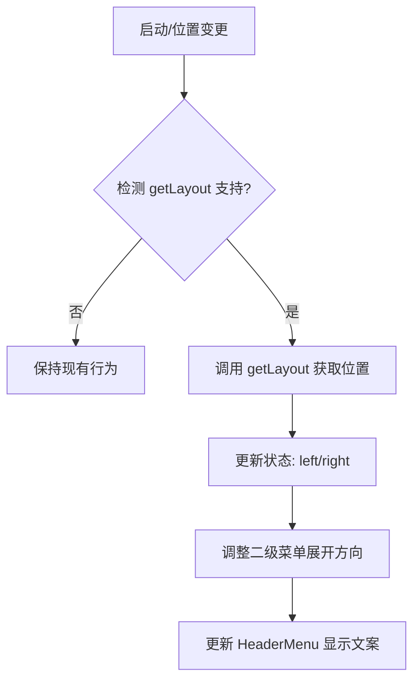
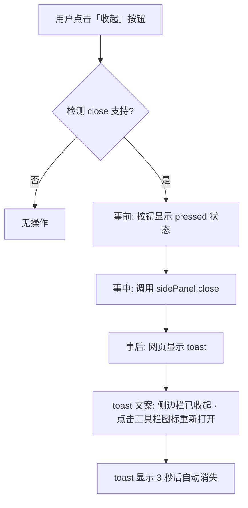

# 侧边栏体验增强

> Status: 功能一已实现 · 功能二/悬浮圆点已砍 · Author: product-manager · Date: 2026-06-30
>
> **决策记录（2026-06-30）**：
> - ✅ **功能一「侧边栏位置感知 + 引导」已实现**：`composables/useSidePanelLayout.ts`（getLayout 探测 + 模块增强补类型）+ HeaderMenu「显示位置」显示「当前：左/右侧」+ 动态切换引导 tooltip。二级菜单展开方向沿用既有视口 clamp（已自动翻转，无需额外逻辑）。
> - ❌ **功能二「收起侧边栏按钮」已砍**：见下方 §4.2，用户决定不做。
> - ❌ **悬浮圆点（AssistiveTouch 式全页面浮标）已砍**：需新增 content script + 全站注入，且 `open()` 用户手势链路有风险，用户决定暂不做。如将来重启，先跑可行性 spike。

## 1. 背景与目标

### 1.1 现状与痛点

基于 Chrome 140+ 的 `chrome.sidePanel` API，我们现在有能力做更多体验优化，但用户反馈了两个明确的痛点：

1. **侧边栏位置感知缺失**
   - 用户希望把侧边栏放在左侧（Chrome 设置里可手动切换）
   - 扩展目前完全不知道侧边栏在哪一侧，导致某些交互（如向左展开的二级菜单）在左侧位置时体验不佳
   - HeaderMenu 里的"显示位置"只是灰显提示，没有充分利用新的 `getLayout()` API

2. **无法快速收起侧边栏**
   - 用户需要临时扩大网页可视区域时，只能通过点击 Chrome 原生关闭按钮或工具栏图标收起
   - 扩展内部没有提供收起按钮，操作路径不够直接
   - 收起后重新打开的引导不明确

### 1.2 技术约束

- `close()`：Chrome 141+ / Edge 141+
- `getLayout()`：Chrome 140+ / Edge 140+
- `onOpened` / `onClosed` 事件：Chrome 141-142+
- `open()` 仍需用户手势触发（Chrome 116+）
- **没有任何 API 可以设置侧边栏位置**（只能读不能写）

### 1.3 目标

- **可感知原则**（核心）：每个功能都要有「事前文案/图标 → 事中反馈 → 事后提示+撤销」的完整闭环
- 优雅降级：老版本浏览器仍可正常使用，只是新功能不可见或有替代提示
- 体验一致性：所有新增交互符合现有产品的视觉语言和操作习惯

### 1.4 成功指标

- 用户侧：收起功能的使用率（有多少用户点击了收起按钮）
- 技术侧：位置检测 API 的成功率（`getLayout()` 成功调用比例）

---

## 2. 用户场景与故事

### 2.1 用户画像

| 角色 | 场景 | 频次 |
|------|------|------|
| 左侧偏好者 | 习惯把侧边栏放左边，因为右手握鼠标，右侧放网页内容 | 长期使用 |
| 临时专注者 | 正在看网页/写代码，需要临时收起侧边栏获得更大视野，之后再打开 | 高频（每天多次） |
| 新手用户 | 不知道 Chrome 可以切换侧边栏位置，需要引导 | 一次性 |

### 2.2 User Story 列表

1. **作为左侧偏好者，我希望扩展能感知侧边栏在左侧，并据此调整界面，以便获得更好的交互体验**
2. **作为临时专注者，我希望在侧边栏里有一个明显的收起按钮，点击后收起侧边栏，以便快速扩大网页视野**
3. **作为临时专注者，我希望在收起侧边栏后，能通过明确的提示知道如何重新打开，以便继续使用标签管理功能**
4. **作为新手用户，我希望看到侧边栏位置的引导提示，以便知道可以在左侧/右侧之间切换**

### 2.3 关键路径

- **收起侧边栏路径**：点击侧边栏内「收起」按钮 → 侧边栏关闭 → 网页显示 toast 提示「点击工具栏图标重新打开」
- **位置感知路径**：扩展启动 → 检测 `getLayout()` → 记录位置 → 根据位置调整 UI（如二级菜单展开方向）→ 用户切换位置时实时更新

---

## 3. 竞品参考

### 3.1 同类侧边栏扩展的交互调研

通过对主流侧边栏扩展的观察，总结常见模式：

| 功能 | 常见做法 | 评价 |
|------|----------|------|
| 收起按钮 | 通常放在右上角或顶部导航栏，用「×」或「折叠」图标 | 放在右上角比较符合直觉 |
| 位置感知 | 大部分扩展不做检测，少数会检测但只用于内部布局调整 | 用户很少意识到扩展在做这件事 |
| 重新打开引导 | 多数没有引导，少数会在收起前提示 | 明确的事后提示很重要 |

### 3.2 我们的策略

- **学什么**：收起按钮放在右上角、使用明确的图标和文案
- **避什么**：不做静默的位置检测（要让用户知道我们在感知）、不尝试设置位置（API 不支持）
- **差异化**：加入完整的可感知闭环（事前提示 → 事中反馈 → 事后引导）

---

## 4. 交互设计

### 4.1 功能一：侧边栏位置感知与引导

#### 4.1.1 信息架构

- 检测层：`background.ts` / sidepanel 启动时调用 `getLayout()`
- 状态层：新增 composable `useSidePanelLayout()` 统一管理位置状态
- UI 层：HeaderMenu 的「显示位置」根据检测结果动态调整提示文案；二级菜单根据位置智能选择展开方向

#### 4.1.2 关键画面

**HeaderMenu「显示位置」项（动态）**：
- **Chrome 140-**（不支持检测）：保持现有灰显，文案「显示位置」，tooltip 保持不变
- **Chrome 140+，右侧**：灰显但显示「当前：右侧」，tooltip「要切换到左侧，请右键侧边栏标题 → Show on left」
- **Chrome 140+，左侧**：灰显但显示「当前：左侧」，tooltip「要切换到右侧，请右键侧边栏标题 → Show on right」

**二级菜单智能展开方向**：
- **右侧**（默认）：子菜单向左展开（现有行为）
- **左侧**：子菜单向右展开（避免超出视口）

#### 4.1.3 交互流（可感知闭环）



#### 4.1.4 边界状态

- **API 调用失败**：静默降级到默认右侧行为，不报错
- **用户在 Chrome 设置里切换位置**：下次打开侧边栏时重新检测，实时更新
- **老版本浏览器**：完全不显示新功能相关的提示，保持现状

### 4.2 功能二：收起侧边栏按钮

#### 4.2.1 信息架构

- 位置：Header 右上角，HeaderMenu 左侧
- 图标：`Minimize2`（横线）或 `X`
- 文案：hover 时 tooltip「收起侧边栏」

#### 4.2.2 关键画面

**Header 区域（新增收起按钮）**：
```
┌─────────────────────────────────────┐
│ 标签大师  XX个标签  [聚焦] [收起] [≡] │
└─────────────────────────────────────┘
```

**收起按钮（不同状态）**：
- **Chrome 140-**（不支持 close）：隐藏按钮
- **Chrome 141+**：显示按钮，hover 变背景色

#### 4.2.3 交互流（可感知闭环）



#### 4.2.4 可感知设计细节

| 阶段 | 设计 |
|------|------|
| 事前 | 按钮 hover 显示 tooltip「收起侧边栏」；点击时按钮有视觉反馈（背景变深） |
| 事中 | 点击后按钮立即进入 disabled 状态，防止重复点击 |
| 事后 | **关键**：在网页层显示 toast 提示（通过 content script 注入？或通过 chrome.notifications？）—— 方案待定，倾向 toast |

#### 4.2.5 边界状态

- **重复点击**：第一次点击后按钮 disabled，防止重复调用
- **API 调用失败**：静默失败，按钮恢复可用状态，toast 提示「收起失败，请点击浏览器原生关闭按钮」
- **老版本浏览器**：完全不显示收起按钮

#### 4.2.6 引导教育

- 首次显示收起按钮时，旁边不额外加引导（功能足够直观）
- 但可以在「更多设置」里加一个选项，控制是否显示收起按钮（后续迭代，本期不做）

---

## 5. 数据模型

### 5.1 实体定义

新增类型 `SidePanelPosition`：
```typescript
type SidePanelPosition = "left" | "right" | "unknown"
```

### 5.2 持久化位置

- **不持久化**：每次打开侧边栏都重新检测 `getLayout()`，因为用户可能随时在 Chrome 设置里切换
- **内存缓存**：在同一次会话期间缓存位置，避免频繁调用 API

### 5.3 能力检测

在全局初始化时检测三个关键能力：
```typescript
const SUPPORTS_SIDE_PANEL_GET_LAYOUT = typeof chrome?.sidePanel?.getLayout === "function"
const SUPPORTS_SIDE_PANEL_CLOSE = typeof chrome?.sidePanel?.close === "function"
const SUPPORTS_SIDE_PANEL_EVENTS = typeof chrome?.sidePanel?.onOpened?.addListener === "function"
```

---

## 6. 接口契约（前后端协作时必填）

- 本期不涉及后端接口。

---

## 7. 性能/安全/兼容

### 7.1 性能预算

- `getLayout()` 调用：每次打开侧边栏最多调用 1 次
- 事件监听：`onOpened` / `onClosed` 如果可用，只在 background 监听一次
- 内存占用：位置状态只占极少内存

### 7.2 安全

- 不请求任何新权限
- 不处理敏感数据

### 7.3 兼容矩阵

| 浏览器 | 最低版本 | 支持功能 |
|--------|----------|----------|
| Chrome | 114-139 | 基础功能，无位置感知，无收起按钮 |
| Chrome | 140 | 位置感知（getLayout），无收起按钮 |
| Chrome | 141+ | 完整功能（getLayout + close） |
| Edge | 114-139 | 同 Chrome 114-139 |
| Edge | 140+ | 同 Chrome 140+ |

---

## 8. 验收标准

### 8.1 功能验收（位置感知）

- [ ] Chrome 140+ 能正确检测到侧边栏在左侧/右侧
- [ ] HeaderMenu 的「显示位置」项根据检测结果动态显示文案
- [ ] 侧边栏在左侧时，HeaderMenu 的二级子菜单向右展开（而非向左）
- [ ] 侧边栏在右侧时，HeaderMenu 的二级子菜单保持向左展开
- [ ] Chrome 140- 浏览器不报错，保持现有行为

### 8.2 功能验收（收起按钮）

- [ ] Chrome 141+ Header 右上角显示「收起」按钮
- [ ] 点击「收起」按钮能正确关闭侧边栏
- [ ] 收起后显示明确的重新打开引导（toast 或其他形式）
- [ ] Chrome 140- 浏览器不显示收起按钮
- [ ] 重复点击不报错

### 8.3 可感知原则验收

- [ ] 收起按钮有 hover tooltip（事前）
- [ ] 收起按钮点击时有视觉反馈（事中）
- [ ] 收起后有明确的重新打开引导（事后）
- [ ] 位置感知的结果在 HeaderMenu 里有视觉呈现（让用户知道我们感知到了）

---

## 9. Non-Goals

- **不做**：通过 API 强制设置侧边栏位置（Chrome 不支持）
- **不做**：通过 `open()` 自动重新打开侧边栏（需要用户手势）
- **不做**：收起按钮的个性化设置（如是否显示、放在哪里）
- **不做**：位置切换的快捷入口（还是引导用户去 Chrome 原生设置）
- **不做**：content script 注入网页 toast（方案复杂，本期用其他方式替代）

---

## 10. 风险与未决问题

### 10.1 已知风险

| 风险 | 影响 | 概率 | 缓解措施 |
|------|------|------|----------|
| Edge 版本落后于 Chrome | 部分 Edge 用户可能看不到收起按钮 | 中 | 优雅降级，老版本不显示按钮即可 |
| `getLayout()` 在某些场景下返回意外值 | 二级菜单展开方向错误 | 低 | 加容错逻辑，返回无效值时默认右侧行为 |
| `close()` 调用失败 | 用户点击收起按钮没反应 | 低 | 加错误处理，失败时按钮恢复可用并显示提示 |

### 10.2 未决问题

> @TODO: 收起后的「事后提示」放在哪里？
>
> - 方案 A：使用 `chrome.notifications.create()` 显示系统通知
> - 方案 B：因为没有 content script 注入机制，简化为——不显示提示，只依赖用户记住可以点击工具栏图标重新打开
>
> **倾向方案 B**（MVP 简化），因为：
> 1. 用户已经习惯通过工具栏图标打开侧边栏
> 2. 避免复杂的 content script 注入
> 3. 如果用户真的忘了，再次点击工具栏图标也能打开

> @TODO: HeaderMenu 二级菜单的展开方向逻辑是否需要抽取复用？
>
> 目前只有 HeaderMenu 有二级菜单，本期就在 HeaderMenu 内部处理即可，后续如果有其他地方需要再抽取。
