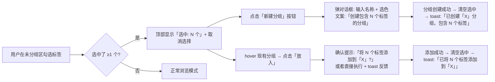

# 标签分组（Tab Groups）

> Status: Draft · Author: product-manager · Date: 2026-06-27 · Feature slug: `tab-groups`

---

## 1. 背景与目标

### 现状/痛点
用户开 30+ 标签后想分类管理（学习/工作/娱乐），但：
- Chrome 原生分组在 tab bar 上操作不便，需要点击 tiny 的分组圆点
- 标签多了后，分组颜色识别困难
- 无法批量将标签加入分组
- 没有一个集中管理所有分组的视图

### 目标
在 sidepanel 中提供：
1. **分组列表页**：集中管理当前窗口所有分组（新建/重命名/改色/解散/展开折叠）
2. **标签卡片分组标识**：在首页/列表视图直观显示标签所属分组
3. **便捷操作**：右键菜单/批量操作将标签加入分组

### 非目标（详见 §9）
不做跨窗口分组、不做云同步、不做分组排序拖拽、不做分组持久化（Chrome 原生已持久化）。

### 成功指标
- 创建分组的操作步数 ≤ 3 步（选标签 → 右键 → 新建分组）
- 分组页首屏渲染 ≤ 100ms（空状态）/ ≤ 200ms（10 个分组场景）

---

## 2. 用户场景与故事

### 用户画像
- **整理型用户**：每天开 30+ 标签，习惯按项目/主题分组
- **多任务切换用户**：在工作/生活/学习场景间频繁切换
- **触发情境**：标签栏拥挤、想批量整理同类标签时

### User Story
- **US-1**：作为整理型用户，我想在分组页看到所有分组一览，以便快速切换查看不同分类的标签
- **US-2**：作为用户，我想给标签改颜色、改名字，以便直观区分不同分组
- **US-3**：作为用户，我想在首页标签卡片上看到所属分组的颜色条和名称，以便一眼知道分类
- **US-4**：作为用户，我想通过右键菜单快速将标签加入现有分组或新建分组，以便操作不打断当前工作
- **US-5**：作为批量操作用户，我想多选标签后一键加入分组，以便提高整理效率

### 关键路径（最长）
```
用户在首页开了 30 个标签
  → 点击导航「分组」进入分组页
  → 看到所有分组 + 未分组标签
  → 点击「+ 新建分组」按钮
  → 弹窗输入名称「工作」+ 选蓝色
  → 在「未分组」区勾选 5 个工作相关标签
  → 点击「加入分组」→ 选择「工作」
  → 5 个标签加入分组，分组页实时更新
  → 回到首页，看到 5 个标签卡片左侧有蓝色条 +「工作」小标签
```

---

## 3. 竞品参考

| 产品 | 同类功能 | 值得学的 | 要避开的 |
|---|---|---|---|
| **Chrome 原生 Tab Groups** | 分组折叠/颜色/命名 | 颜色标识直观 | 操作入口太浅、无集中管理视图 |
| **OneTab** | 标签列表分类 | 列表化展示清晰 | 分组即关闭标签，破坏状态 |
| **Workona** | 工作空间 | 分组切换丝滑 | 需要登录、太重 |
| **Tab Group Manager (Chrome 扩展)** | 分组管理弹窗 | 分组列表视图清晰 | 功能太杂、有广告 |

### 差异化定位
- **轻量**：无账号、无云同步，只做 Chrome 原生分组的「增强管理视图」
- **集成**：与现有 sidepanel 深度集成，不用新开弹窗
- **复用**：所有分组数据 100% 来自 Chrome 原生，无额外存储

---

## 4. 交互设计

### 4.1 信息架构
```
sidepanel 导航
  ├── 首页（已有）
  ├── 稍后处理（已有）
  ├── 分组（← 新增，激活状态）
  └── 历史（占位）

分组页结构
  ├── [+ 新建分组] 按钮（顶部）
  ├── 分组列表
  │   ├── 分组 1（颜色条 + 名称 + 标签数 + [展开/折叠] + [⋯] 更多菜单）
  │   │   └── 标签列表（展开时显示，复用 TabListItem）
  │   ├── 分组 2
  │   └── ...
  └── 未分组（特殊分组，始终在最后）
      └── 未分组标签列表
```

### 4.2 分组列表页布局（ASCII 图）
```
┌─────────────────────────────────────┐
│ 标签大师 · [设置]                    │ ← Header（复用）
├─────────────────────────────────────┤
│ [首页] [稍后] [分组] [历史]         │ ← Nav（分组激活）
├─────────────────────────────────────┤
│ [+ 新建分组]                         │ ← 顶部操作按钮
├─────────────────────────────────────┤
│ 🟦 工作 (5) [▼] [⋯]                 │ ← 分组标题行（折叠态）
│ 🟩 学习 (3) [▼] [⋯]                 │
│ 🟨 娱乐 (8) [▼] [⋯]                 │
├─────────────────────────────────────┤
│ ⬜ 未分组 (14) [▼]                   │ ← 未分组区
│   ├── ☑ 标签 1                      │
│   ├── ☑ 标签 2                      │
│   └── ...                           │
├─────────────────────────────────────┤
│ [取消]  [加入分组 (2)]              │ ← 底部操作栏（选中未分组标签时显示）
└─────────────────────────────────────┘
```

**展开状态的分组**：
```
┌─────────────────────────────────────┐
│ 🟦 工作 (5) [▲] [⋯]                 │ ← 展开图标变向上
│   ├── [标签 1] [X]                  │ ← 标签项（复用 TabListItem）
│   ├── [标签 2] [X]                  │
│   └── ...                           │
└─────────────────────────────────────┘
```

**分组「⋯」更多菜单**：
```
┌───────────────┐
│ 重命名        │
│ 改颜色 →      │ → 子菜单：grey/blue/red/yellow/green/pink/purple/cyan/orange
│ 展开/折叠     │
│ 解散分组      │ → 确认弹窗
│ 关闭全部分组标签 │
└───────────────┘
```

### 4.3 新建分组弹窗
```
┌─────────────────────────┐
│ 新建分组            [X] │
├─────────────────────────┤
│ 名称                    │
│ [ 工作         ]        │
│                         │
│ 颜色                    │
│ [🟦] [🟥] [🟨] [🟩]    │ ← 9 个颜色方块，点击选中
│ [🟪] [🟫] [⬜] [🟩]    │
│ [🔵]                    │
│                         │
│  [取消]    [创建]       │ ← 创建按钮在 0 标签时也可用？见 §4.4 决策
└─────────────────────────┘
```

### 4.4 关键决策：空分组策略

**决策**：不允许创建空分组。

**原因**：
- Chrome 原生 API 限制：`chrome.tabs.group()` 必须传入 ≥1 个 tabId 才能创建分组
- 避免用户困惑：创建了空分组但在 tab bar 看不到

**替代流程**：
1. 在首页多选标签 → 右键 →「移到分组」→「新建分组」→ 弹窗输入名称颜色 → 创建
2. 在分组页的「未分组」区多选标签 → 底部按钮「新建分组」→ 弹窗 → 创建

### 4.5 首页标签卡片的分组标识

在现有 TabListItem / TabTileItem 上增加：
- **列表视图**：左侧 active 条旁边增加分组颜色条（2px 宽），标题下方显示分组名称小标签
- **平铺视图**：卡片顶部增加分组颜色条（2px 高），底部显示分组名称小标签
- **图标视图**：图标下方增加小颜色圆点

**列表视图示例**：
```
[🟦] 📄 标签标题          [X]
      [工作]  google.com
```

### 4.6 右键菜单「移到分组」

修改现有右键菜单，在合适位置插入：
```
┌───────────────────┐
│ 刷新              │
│ 复制标签          │
│ 固定标签          │
│ 静音              │
│ ───────────────── │
│ 移到分组 →        │ → 子菜单
│ 添加标记          │
│ 设置编号          │
│ 稍后处理          │
│ ───────────────── │
│ 复制 URL          │
│ 关闭标签          │
│ 关闭其他标签      │
└───────────────────┘
```

「移到分组」子菜单：
```
┌───────────────────┐
│ [新建分组...]     │
│ ───────────────── │
│ 🟦 工作           │
│ 🟩 学习           │
│ 🟨 娱乐           │
│ ───────────────── │
│ [移出分组]        │ → 仅当标签已在分组时显示
└───────────────────┘
```

### 4.7 边界状态

| 场景 | 系统行为 |
|---|---|
| 用户在 Chrome 原生 tab bar 改了分组名/颜色 | 监听 `tabGroups.onUpdated`，分组页实时同步 |
| 用户拖动标签跨窗口 | 标签自动从原分组移除（Chrome API 限制：分组只能在同一窗口） |
| 分组里最后一个标签关闭 | 分组自动消失（Chrome 原生行为） |
| 聚焦模式下的「🌙 已隐藏」分组 | 在分组页**不显示**（过滤掉，避免互相干扰） |
| 标签已在分组 A，又被加到分组 B | 自动从分组 A 移除（Chrome API 原生行为：一个标签只能在一个分组） |
| 分组页已打开时，用户在别处关闭了分组 | 分组页实时更新，删除该分组项 |

### 4.8 引导
- **首次进入分组页**：顶部显示一次性提示条「💡 在这里管理所有标签分组，分组数据与 Chrome 原生同步」
- 之后不再显示

---

## 5. 数据模型

### 5.1 Chrome 原生数据（唯一真实来源）
所有分组数据直接来自 Chrome API，不做额外存储：
- `chrome.tabGroups.query()` → 获取所有分组
- `chrome.tabs.query({ groupId: xxx })` → 获取分组内的标签

### 5.2 前端 composables 状态
```typescript
// composables/useTabGroups.ts 建议结构
interface TabGroupWithTabs extends chrome.tabGroups.TabGroup {
  tabs: TabItem[]  // 分组内的标签（关联 useTabManager 的 tabs）
}

const tabGroups = ref<TabGroupWithTabs[]>([])
const ungroupedTabs = computed(() => tabs.value.filter(t => t.groupId === chrome.tabGroups.TAB_GROUP_ID_NONE))
```

### 5.3 持久化策略
- **无额外持久化**：100% 依赖 Chrome 原生（分组已随用户 Profile 同步）
- **引导标志**：`chrome.storage.local.set({ tabGroupsGuideShown: boolean })`

---

## 6. 接口契约

所有交互通过 Chrome API，无后端：

| API 调用 | 时机 | 输入 | 输出 |
|---|---|---|---|
| `chrome.tabGroups.query({ windowId: chrome.windows.WINDOW_ID_CURRENT })` | 分组页初始化/刷新 | windowId | Promise<TabGroup[]> |
| `chrome.tabs.group({ tabIds, groupId? })` | 新建分组/加入现有分组 | tabIds（必选）+ groupId（可选，不传则新建） | Promise<number>（groupId） |
| `chrome.tabs.ungroup(tabIds)` | 移出分组 | tabIds | Promise<void> |
| `chrome.tabGroups.update(groupId, { title?, color?, collapsed? })` | 重命名/改色/展开折叠 | groupId + 要更新的字段 | Promise<TabGroup> |
| `chrome.tabs.remove(tabIds)` | 关闭分组内所有标签 | tabIds | Promise<void> |
| `chrome.tabGroups.onCreated/onRemoved/onUpdated/onMoved` | 监听分组变化 | callback | void |

**过滤聚焦模式分组**：
- 查询分组后，过滤掉 `title === '🌙 已隐藏'` 的分组

---

## 7. 性能 / 安全 / 兼容

### 7.1 性能预算
- 分组页首屏渲染：≤ 100ms（空）/ ≤ 200ms（10 分组 × 10 标签）
- 分组展开/折叠动画：≤ 150ms
- 监听事件响应：≤ 50ms（用户在原生改分组名 → sidepanel 更新）

### 7.2 安全
- 无新增网络请求
- 无新增 manifest 权限（`tabGroups` 权限已有，被聚焦模式使用）
- 不存储敏感数据

### 7.3 兼容
- **目标矩阵**：Chrome 89+ / Edge 89+ × macOS / Windows
- **API 检测**：`typeof chrome?.tabGroups?.query === 'function'`
- **降级策略**：不支持时，导航「分组」入口置灰，hover 提示「需要 Chrome 89+ / Edge 89+」

---

## 8. 验收标准

### 功能验收
- [ ] 导航「分组」入口可点击，进入分组页
- [ ] 分组页显示当前窗口所有分组（标题 + 颜色 + 标签数）
- [ ] 分组页不显示「🌙 已隐藏」聚焦分组
- [ ] 分组可展开/折叠，展开时显示标签列表（复用 TabListItem）
- [ ] 分组「⋯」菜单：重命名、改颜色（9 选 1）、解散分组、关闭全部分组标签
- [ ] 未分组标签单独显示在最后
- [ ] 未分组标签可多选，底部按钮「加入分组」→ 选择现有分组或「新建分组」
- [ ] 首页标签卡片显示分组标识：
  - 列表视图：左侧颜色条 + 标题下分组名称小标签
  - 平铺视图：顶部颜色条 + 底部分组名称小标签
- [ ] 首页标签右键菜单 →「移到分组」子菜单：新建分组/现有分组/移出分组（按需显示）
- [ ] 批量选择标签 → 底部批量操作栏 →「加入分组」
- [ ] 用户在 Chrome 原生修改分组名/颜色 → sidepanel 实时同步（监听 onUpdated）
- [ ] 分组里最后一个标签关闭 → 分组自动消失，分组页更新
- [ ] 首次进入分组页显示引导条

### 性能验收
- [ ] 分组页首屏渲染 ≤ 200ms（10 分组场景）
- [ ] 分组展开/折叠 ≤ 150ms
- [ ] 原生修改分组 → sidepanel 更新 ≤ 50ms

### 兼容验收
- [ ] Chrome 89+ × macOS / Windows 通过
- [ ] Edge 89+ × macOS / Windows 通过
- [ ] 旧版本浏览器分组入口置灰 + hover 提示

---

## 9. Non-Goals（明确不做）

- ❌ **跨窗口分组**：Chrome API 不支持，分组只能在同一窗口
- ❌ **云同步分组**：Chrome 原生已随 Profile 同步，无需重复
- ❌ **分组排序拖拽**：V2 再说，本期不做
- ❌ **空分组**：Chrome API 限制，且用户体验不好
- ❌ **分组预设/模板**：增加复杂度，MVP 不做
- ❌ **分组标签页截图**：超出范围
- ❌ **后端接口**：本期纯前端

---

## 10. 风险与未决问题

### 已知风险
| 风险 | 影响 | 缓解 |
|---|---|---|
| 用户在原生删除分组 | 分组页需实时响应 | 监听 `tabGroups.onRemoved` |
| 聚焦模式与分组功能互相干扰 | 体验混乱 | 严格过滤「🌙 已隐藏」分组 |
| 分组太多时分组页滚动性能差 | 卡顿 | 虚拟滚动？（可选，视性能测试结果） |

### 未决问题
> @TODO: 分组页的标签是否支持直接拖拽到其他分组？还是只通过右键/批量按钮操作？倾向先不做拖拽，简化 MVP。
> @TODO: 未分组标签的批量操作，是否支持直接选多个后「新建分组」？是的，已在 §4.4 定义。
> @TODO: 分组解散时，是否需要确认弹窗？是的，避免误操作。

---

## 分组创建/加入交互重设计（2026-06-30）

### 背景与问题
现有流程的痛点：
1. **入口混乱**：顶部按钮有「从选中创建分组」/「添加到分组」/「+ 新建分组」三种状态，用户困惑
2. **步骤割裂**：选标签 → 点按钮 → 弹对话框选分组 → 再弹另一个对话框新建，流程不连贯
3. **禁用态无指引**：「新建分组」灰掉时，用户不知道为什么（需要先有未分组标签并选中）
4. **心智模型不清晰**：用户期望「选标签 → 选目标分组（新建或已有）」是一个完整动作

### 竞品参考（行业最佳实践）
| 产品 | 做法 | 我们借鉴 |
|---|---|---|
| **Chrome 原生** | 右键标签 →「将标签添加到新组」/ 拖到现有组圆点 | 右键菜单保持，简化分组页 |
| **Toby** | 标签卡片直接拖入侧边栏 workspace / 双击 workspace 重命名 | 拖拽是 V2，本期做「点击即分配」 |
| **Workona** | 先创建 workspace，再把标签拖进去；或选标签后点「移动到」 | 「选择目标分组」作为核心动作 |
| **Arc** | 拖动标签到侧边栏 spaces，或右键「移到 Space」 | 简单明确的动词「移到」 |

### 推荐方案：**「选择标签 → 选择目标」一步到位**

**核心理念**：
- ✅ 先选中要分组的标签（可多选）
- ✅ 然后选择「放到哪里」（新建分组 或 加入现有分组）
- ✅ 这两个动作在同一个上下文中完成，不割裂

---

#### 10.1 信息架构调整

**分组页结构简化**：
```
分组页
  ├── [+ 管理分组] 按钮（仅分组管理：展开/折叠/重命名/解散，不用于新建）
  ├── 分组列表
  │   └── 每个分组支持「放入选中标签」（hover 时显示）
  └── 未分组区
      └── 标签带复选框，勾选即选中
```

---

#### 10.2 交互设计（关键）

##### 场景 A：在分组页创建/加入分组

**ASCII 布局**：
```
┌─────────────────────────────────────┐
│ 标签大师 · [设置]                    │
├─────────────────────────────────────┤
│ [首页] [稍后] [分组] [历史]         │
├─────────────────────────────────────┤
│ 选中: 2 个标签  [取消选择]          │ ← 选中态顶部栏（选中时出现）
├─────────────────────────────────────┤
│ [新建分组 +]                        │ ← 新建按钮（选中时高亮，点击弹命名）
│                                     │
│ 🟦 工作 (5) [▼] [⋯]  [← 放入]      │ ← hover 现有分组显示「放入」
│ 🟩 学习 (3) [▼] [⋯]  [← 放入]      │
│ 🟨 娱乐 (8) [▼] [⋯]  [← 放入]      │
├─────────────────────────────────────┤
│ ⬜ 未分组 (14) [▼]                  │
│   ├── ☑ 标签 1                      │ ← 复选框始终可见，勾选即选中
│   ├── ☑ 标签 2                      │
│   └── ...                           │
└─────────────────────────────────────┘
```

**交互流程图**：


##### 场景 B：首页批量加入分组

**保持现有入口**，但优化对话框：
- 首页批量选择 → 底部栏「加入分组」→ 弹一个**组合对话框**
- 对话框顶部：「新建分组」按钮 + 输入框 + 颜色
- 对话框下方：现有分组列表
- 用户可以二选一，不用切换对话框

---

#### 10.3 可感知原则落地（必填）

| 用户动作 | 事前（文案/图标/预期） | 事中（反馈） | 事后（提示 + 撤销） |
|---|---|---|---|
| 勾选未分组标签 | 复选框始终可见，tooltip:「选择此标签进行分组」 | 选中态蓝色背景，顶部栏即时更新「选中: N 个」 | - |
| 点击「取消选择」 | 文字按钮「取消选择」 | 所有复选框清空，顶部栏消失 | - |
| 点击「新建分组」（选中态） | 蓝色按钮「新建分组 +」，tooltip:「用选中的 N 个标签创建新分组」 | 弹对话框，标题明确「创建包含 N 个标签的分组」 | toast:「✅ 已创建「X」分组（N 个标签）」，无撤销（用户可手动解散） |
| 点击现有分组的「放入」 | hover 时分组右侧出现蓝色按钮「← 放入」，tooltip:「将选中的 N 个标签添加到此分组」 | 点击后按钮变 loading 态 | toast:「✅ 已将 N 个标签添加到「X」」，无撤销（用户可手动移出） |
| 「新建分组」灰掉（无未分组标签） | 灰按钮，tooltip 明确说明原因:「所有标签都已分组，没有可用于新建分组的标签」 | - | - |

##### 空态引导

**无任何分组时**：
```
┌─────────────────────────────────────┐
│ 还没有分组 🗂️                       │
│                                     │
│ 在下方「未分组」里勾选几个标签，      │
│ 然后点上面的「新建分组」就能创建啦！  │
└─────────────────────────────────────┘
```

**所有标签都已分组时**：
```
┌─────────────────────────────────────┐
│ 所有标签都已分组 ✨                  │
│                                     │
│ 可以展开分组查看，或在首页打开新标签  │
│ 后再来分组                          │
└─────────────────────────────────────┘
```

---

#### 10.4 改动点（对照 code-map F 节）

| 文件 | 改动内容 |
|---|---|
| `components/GroupListPage.vue` | **重写工具栏**：去掉混乱的三态按钮，改为选中态顶部栏 + 「新建分组」按钮 + 现有分组 hover「放入」按钮；复选框始终可见，去掉「进入批量模式」概念 |
| `components/CreateGroupDialog.vue` | 标题根据是否有选中标签动态变化：「创建包含 N 个标签的分组」或「新建分组」 |
| `components/GroupItem.vue` | 增加 hover 状态下的「放入」按钮（仅当有选中标签时显示） |
| `components/TabContextMenu.vue` | **保持不变**，右键「移到分组」子菜单继续使用 |
| `sidepanel.vue` | **无改动** |

---

#### 10.5 验收标准（新增/改动部分）

- [ ] 分组页未分组区的标签**复选框始终可见**，不需要先进入批量模式
- [ ] 勾选 ≥1 个标签后，**顶部显示选中栏**：「选中: N 个标签」+「取消选择」按钮
- [ ] 选中态下，**分组列表上方显示蓝色「新建分组 +」按钮**
- [ ] 选中态下，**hover 现有分组时右侧显示「← 放入」按钮**
- [ ] 点击「新建分组」→ 弹对话框，**标题明确显示包含的标签数**
- [ ] 点击「放入」→ **直接执行**（或二次确认？待讨论），然后 toast 反馈
- [ ] 操作完成后**自动清空选中**，顶部栏消失
- [ ] 无未分组标签时，「新建分组」灰掉，**tooltip 明确说明原因**
- [ ] 空态（无分组 + 无未分组）显示**清晰引导文案**

---

#### 10.6 Non-Goals（本期不做）

- ❌ 拖拽标签到分组（V2 再考虑）
- ❌ 分组排序拖拽
- ❌ 批量从分组里移出标签（保持现有单个移出 + 解散分组）

---

#### 10.7 风险与决策

| 问题 | 决策 | 原因 |
|---|---|---|
| 点击「放入」是否需要二次确认？ | **不需要**，直接执行 + toast | 这是轻量操作，用户可手动移出，确认会打断流程 |
| 复选框始终可见会不会干扰浏览？ | **不会**，分组页就是管理页面，操作优先 | 参考文件管理器，复选框默认显示是行业惯例 |
| 首页批量「加入分组」对话框是否也要改？ | **本期不改**，保持现有 | 先改好分组页，再考虑首页的一致性 |
