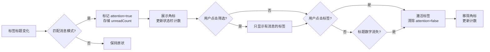

# 标签消息通知感知

> Status: Draft · Author: product-manager · Date: 2026-07-01

## 1. 背景与目标

### 现状与痛点
用户打开大量标签页时，难以快速识别哪个标签有新消息通知。虽然 Chrome 原生标签在有新消息时会修改标题（如 `(3) Gmail`、`·3 新消息`），但在标签密集或使用侧边栏标签管理器时，这种变化不够明显，且缺乏统一的筛选和管理功能。

项目现有状态体系已经预留了 `attention` 字段和对应的 UI 组件（底部状态栏筛选、状态配置），但目前是硬编码为 false，未实际激活。

### 目标
- **主目标**：通过解析标签标题变化，自动识别有新消息通知的标签，并在侧边栏中以明显方式展示
- **副目标**：提供快速筛选功能，让用户一键查看所有有消息的标签；点击标签后自动清除消息状态
- **不做什么**：不通过 content script 注入页面监听 DOM/Notification API（权限成本高）；不做后端同步

### 成功指标
- 识别准确率 >95%（对常见消息网站如 Gmail、微信网页版、钉钉、Slack、Telegram、知乎等）
- 误报率 <5%（排除标题中包含数字但不是消息的情况，如 `(2024) 年度报告`）
- 用户操作路径：从发现有消息到点击标签不超过 2 步

## 2. 用户场景与故事

### 用户画像
- **角色**：多任务处理者、客服、社媒运营
- **频次**：日常打开 20+ 标签页，经常切换
- **触发情境**：等待重要邮件/消息，但不想逐个标签检查

### User Story 列表
1. **作为**用户，**我想**一眼看到侧边栏中哪个标签有新消息，**以便**快速响应
2. **作为**用户，**我想**一键筛选出所有有消息的标签，**以便**集中处理
3. **作为**用户，**我想**点击标签后消息状态自动消失，**以便**知道哪些已处理
4. **作为**用户，**我想**知道当前总共有多少条消息待处理，**以便**评估工作量

### 关键路径
```
标题变化 → 解析消息模式 → 标记 attention=true → 展示角标/数字 → 用户筛选 → 点击标签 → 清除状态
```

## 3. 竞品参考

### 竞品分析
- **Toby**：未做专门的消息通知识别，依赖 Chrome 原生标签展示
- **Workona**：类似 Toby，主要聚焦工作区管理，未做消息识别
- **OneTab**：极简主义，无此功能
- **Session Buddy**：聚焦会话保存/恢复，无此功能
- **Tab Wrangler**：聚焦标签休眠，有简单的数字角标展示，但无消息模式识别

### 我们的差异化
- **零额外权限**：完全基于已有的 `tabs` 权限，通过标题变化识别
- **融入现有状态体系**：复用已有的 `attention` 字段、底部状态栏筛选、状态优先级
- **可感知设计**：角标 + 数字展示，点击即清除，符合用户预期

### 标题消息模式调研
常见网站的消息标题模式：
- **前缀括号**：`(3) Gmail`、`(2) 微信网页版`
- **前缀圆点**：`·3 新消息`、`•5 通知`
- **后缀**：`你有 3 条新消息`、`(新消息) - 知乎`

## 4. 交互设计

### 信息架构
```
现有体系扩展：
- TabItem.attention: boolean（激活，不再硬编码）
- 新增 TabItem.unreadCount: number（可选，存储解析出的数字）
- 状态优先级：attention 加入 getHighestPriorityStatus
- 底部状态栏：attention 筛选已存在，激活即可
```

### 关键画面描述

#### 标签卡片角标展示
- **位置**：FavIcon 右上角（与其他状态角标同一位置）
- **展示内容**：
  - 有数字时：`🔔3`（图标 + 数字）
  - 无数字时：`🔔`
- **优先级**：在 `recording`、`sharing`、`playing` 之后，`muted` 之前（比静音更重要，但比录制/共享/播放次要）

#### 底部状态栏筛选
- **已有组件**：`引起注意(N)` 按钮，保持不变
- **点击行为**：筛选出所有 `attention=true` 的标签，与其他筛选一致

#### 标题展示（可选增强）
- **位置**：标签标题前缀
- **展示内容**：`[3]` 或 `(3)`
- **说明**：可选 P1 功能，主功能先确保角标展示

### 交互流



### 边界状态

#### 空态
- 无消息标签时：底部状态栏「引起注意(0)」禁用，与其他状态一致

#### 加载态
- 标签加载中：标题可能不完整，暂时不解析，等待标题稳定

#### 误判处理
- **策略**：严格模式匹配，宁愿漏识别不误识别
- **排除规则**：
  - 数字 >999 时忽略（可能是文章 ID/年份）
  - 包含 `2020`、`2021`、`2022`、`2023`、`2024`、`2025`、`2026` 等年份特征时忽略
  - 数字在标题中间且前后无明显消息关键词时忽略
- **手动纠正（可选 P2）**：用户可右键标签手动标记/取消标记「引起注意」

#### 极限态
- 10+ 标签同时有消息：角标正常展示，状态栏显示总数，筛选正常工作
- 消息数字为 0：不标记 attention（有些网站标题会显示 `(0) 新消息`）

### 引导与教育
- **首次使用**：无需特殊引导，用户自然会注意到角标
- **问号说明**：底部状态栏「引起注意」按钮的 hover 说明可微调为「有新消息通知的标签（点击标签后自动清除）」

### 可感知设计（必填）

#### 事前 - 可预期
- **文案**：
  - 底部状态栏：`引起注意(3)`（沿用现有）
  - 问号说明：`有新消息通知的标签（点击标签后自动清除）`
- **图标**：`🔔`（沿用现有，用户认知一致）

#### 事中 - 有反馈
- **标题变化**：无额外动画（避免干扰），但角标会立即出现/消失
- **筛选交互**：与其他筛选一致，点击后列表立即更新
- **点击标签**：激活标签 + 角标立即消失 + 状态栏数字立即减 1

#### 事后 - 可撤销
- **清除状态**：点击标签自动清除（主方式）
- **手动恢复**：若误点击，等待下次标题变化自动恢复；或右键手动标记（可选 P2）
- **重置全部**：刷新侧边栏/重新打开扩展会重新解析所有标签标题（符合用户预期）

## 5. 数据模型

### 实体定义
```typescript
// 扩展现有 TabItem 类型（types/tab.ts）
interface TabItem {
  // ... 现有字段
  attention: boolean  // 激活，不再硬编码 false
  unreadCount?: number  // 新增：解析出的未读消息数（可选）
}
```

### 持久化位置
- **不需要持久化**：attention/unreadCount 完全基于当前标签标题实时解析，关闭浏览器后无需保存
- **例外**：若用户手动标记（P2），手动标记状态可存入 `chrome.storage.local`

### 状态生命周期
```
触发源：
1. chrome.tabs.onUpdated 事件（标题变化）
2. 标签激活事件（清除状态）
3. 定期重新扫描（可选，兜底）

状态变更：
标题匹配 → attention=true, unreadCount=数字
标签激活 → attention=false, unreadCount=undefined
标题数字消失 → attention=false, unreadCount=undefined
```

## 6. 接口契约

### 内部函数约定（前后端一体）

#### 标题解析函数
```typescript
// lib/titleNotificationParser.ts
/**
 * 解析标题中的消息通知
 * @param title 标签标题
 * @returns { hasNotification: boolean; count?: number }
 */
function parseTitleNotification(title: string): {
  hasNotification: boolean
  count?: number
}
```

**模式匹配规则（按优先级）**：
1. `^(\(\d+\))\s*` - 前缀括号，如 `(3) Gmail`
2. `^(\[\d+\])\s*` - 前缀方括号，如 `[2] 微信`
3. `^[·•](\d+)\s*` - 前缀圆点数字，如 `·3 新消息`
4. `(\d+)\s*(条|新消息|通知)\s*$` - 后缀数字，如 `你有 3 条新消息`
5. `有\s*(\d+)\s*(条|新消息|通知)` - 中间包含，如 `你有 3 条新消息`

**排除规则**：
- 数字 > 999 → 忽略
- 数字是 2020-2030 → 忽略
- 数字前后无消息关键词 → 忽略

#### 标签更新处理函数
```typescript
// composables/useTabs.ts（或类似位置）
/**
 * 处理标签更新事件
 */
function handleTabUpdated(tabId: number, changeInfo: chrome.tabs.TabChangeInfo, tab: chrome.tabs.Tab)
```

#### 标签激活处理函数
```typescript
/**
 * 处理标签激活事件
 */
function handleTabActivated(activeInfo: chrome.tabs.TabActiveInfo)
```

## 7. 性能/安全/兼容

### 性能预算
- **标题解析时间**：<1ms per title（正则匹配很快）
- **onUpdated 响应延迟**：<100ms（用户几乎无感知）
- **内存占用**：可忽略（只是增加两个小字段）
- **CPU 占用**：仅在标题变化时解析，无额外负担

### 安全
- **权限最小化**：使用已有 `tabs` 权限，无需新增
- **无数据上传**：标题解析完全在本地，不发送任何数据到服务器
- **无 DOM 注入**：不使用 content script 注入页面，避免安全风险

### 兼容
- **目标浏览器**：Chrome 88+（Manifest V3 要求）
- **Edge 兼容**：是（Chrome 同源代码）
- **多平台**：macOS/Windows/Linux（无平台特定代码）
- **暗色模式**：兼容（角标图标在暗色模式下也可见）

## 8. 验收标准

### 功能验收
- [ ] 能识别 `(3) Gmail` 模式的标题，并标记 attention=true
- [ ] 能识别 `·3 新消息` 模式的标题，并标记 attention=true
- [ ] 能识别 `你有 3 条新消息` 模式的标题，并标记 attention=true
- [ ] 不识别 `(2024) 年度报告` 这种年份标题
- [ ] 不识别 `Article 1234` 这种文章 ID 标题
- [ ] 标签卡片 FavIcon 位置展示 🔔 或 🔔3 角标
- [ ] 底部状态栏「引起注意(N)」显示正确的消息标签数
- [ ] 点击「引起注意」筛选只显示有消息的标签
- [ ] 点击有消息的标签后，该标签的 attention 状态清除，角标消失
- [ ] 标题中消息数字消失后，attention 状态自动清除
- [ ] 当前激活的标签即使有消息也不标记 attention（用户正在看，不需要提醒）

### 性能验收
- [ ] 打开 100 个标签页时，侧边栏响应无明显卡顿
- [ ] 标签标题频繁变化时，UI 无闪烁
- [ ] 内存占用增加 <5MB

### 兼容验收
- [ ] Chrome 88+ 正常工作
- [ ] Edge 88+ 正常工作
- [ ] macOS/Windows 双平台正常工作
- [ ] 暗色模式正常显示角标

## 9. Non-Goals

### 本期不做
- ❌ Content script 注入页面监听 Notification API
- ❌ FavIcon 变化检测（P1 可选，看效果再决定）
- ❌ 手动标记/取消标记 attention 状态（P2 可选）
- ❌ 批量清除所有消息状态
- ❌ 消息通知声音提醒
- ❌ 跨设备同步消息状态
- ❌ 智能识别消息重要程度

### 明确不做
- ❌ 修改标签页原生标题（只读取，不写入）
- ❌ 使用 `chrome.notifications` API 弹系统通知（用户不需要重复提醒）

## 10. 风险与未决问题

### 已知风险
| 风险 | 影响 | 概率 | 缓解措施 |
|------|------|------|----------|
| 误识别 | 中 | 中 | 严格模式匹配，排除年份等常见误判；可通过更新规则迭代优化 |
| 漏识别 | 中 | 低 | 覆盖主流网站模式；后续可收集用户反馈增加新模式 |
| 性能问题 | 低 | 低 | 正则匹配很轻量，且只在标题变化时触发 |

### 未决问题
- > @TODO: 是否展示具体的未读数字？还是只展示 🔔 图标？建议 MVP 先展示图标 + 数字，看效果再调整
- > @TODO: attention 在状态优先级中的具体位置？建议放在 recording/sharing/playing 之后，muted 之前
- > @TODO: 是否需要定期重新扫描所有标签标题（兜底）？建议 MVP 先只依赖 onUpdated 事件，后续看是否需要

### 后续可扩展方向
1. **自定义模式**：允许用户自定义消息匹配规则（高级功能）
2. **静音网站**：对某些网站的消息不提醒
3. **消息历史**：记录哪些标签有过消息（可选）
4. **FavIcon 变化检测**：补充标题解析，对不修改标题但修改 FavIcon 的网站也能识别（P1）
