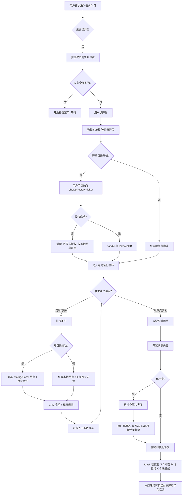
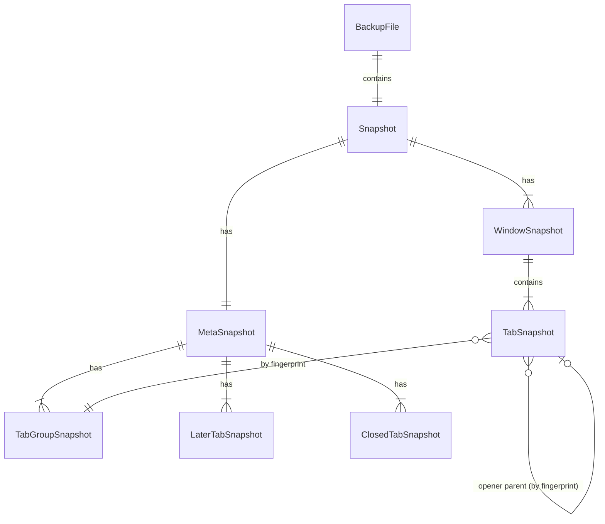

# 标签会话同步与备份

> Status: Draft · Author: plugs-pm · Date: 2026-07-25
> 阶段范围：**阶段一纯本地**（本次开发范围）。阶段二云同步仅预留接口与 UI 入口，不在本期实现。

---

## 1. 背景与目标

### 1.1 现状与痛点

- **Chrome 没有官方的"标签会话持久化"机制**。重启浏览器、崩溃、误关窗口后，用户面对的是 `chrome.sessions.getRecentlyClosed` 仅 25 条最近关闭 + `MAX_SESSION_RESULTS` 上限，且**重启后即清空**。多窗口、几十上百标签的工作上下文经常一次性蒸发。
- **标记/分组/稍后处理等用户投入会"凭空消失"**：本插件的自定义标记（`customTags`）、标签-标记映射（`tabTagsMap`）、稍后处理列表（`laterTabs`）、最近关闭（`recentlyClosed`）等数据全部存在 `chrome.storage.local`，**扩展卸载/重装即全部丢失**。更隐蔽的痛点：`chrome.sessions.setTabValue` **在 Chrome/Edge 不存在**（Firefox 专属 API），Chrome 没有持久 tabId，所以标记按 `tabId` 绑定后，**关闭/重启即对不上**——这是项目里 `TagBar.vue` 已存在的 `TAG_BIND_NOTICE` 老痛点的根因，无法靠 fingerprint 根除，只能靠"会话快照 + 重启恢复手动指派"兜底。
- **OneTab 类竞品的软肋**：OneTab 把标签压缩成 URL 列表文本，无 schema、无标记/分组元数据、无版本号、无定时备份、无冲突处理——多设备同写同一文件必丢数据。这是我们的差异化机会。
- **用户自述诉求**（已与用户核实）："标签数据永不丢失"——不只是 tab 列表，而是"我精心整理的工作上下文（标记+分组+稍后+设置）整体可回滚到任意时间点"。

### 1.2 目标

- **一句话**：在不依赖后端的前提下，让用户标签会话 + 自定义标记/分组/稍后/设置，能定时/手动备份到本地缓存与用户指定目录，崩溃/重启/卸载后可按时间点恢复，冲突由用户手动裁决（绝不自动合并丢数据）。
- **本期解决**：纯本地双备份（chrome.storage.local 缓存 + 用户目录 File System Access API）、7 天循环 + GFS 分层保留、快照手动锁定保护、OneTab/JSON/.md 导入导出、冲突手动解决界面、5 条 API 限制首次告知弹窗。
- **本期不解决**：云同步（阶段二，仅预留接口与 UI 入口置灰）、加密（阶段二 Pro 能力，本期明文本地存储但告知用户）、跨设备自动合并（永久不做自动合并，永远用户裁决）。

### 1.3 成功指标（可量化）

| 指标 | 基线 | 目标 |
|---|---|---|
| 崩溃/重启后用户能找回上一个工作上下文 | 不可能 | 100% 可找回（最近 24h 内任意时间点） |
| 备份占用本地空间可见 | 不可见 | UI 实时显示缓存大小 / 目录大小 / 快照数 |
| 标记/分组等元数据在扩展重装后可恢复 | 全丢 | 100% 可通过导入备份恢复 |
| 用户对 API 限制知情率 | 0%（默默承受） | 100%（首次开启强制弹窗确认） |
| 操作步数：从启动恢复到完成 | N/A | ≤ 3 步（点入口→选快照→确认恢复） |

---

## 2. 用户场景与故事

### 2.1 用户画像

- **重度研究/工作者**：常态 80–300 标签、5–10 窗口，标记/分组高度依赖，关浏览器前不主动整理。
- **跨设备工作者**：办公机+家用机，希望"昨天家里的工作上下文今天在公司能接着用"（阶段二云同步，阶段一靠手动导入导出文件）。
- **谨慎型用户**：经历过 Chrome 崩溃丢标签，对"自动行为"高度警惕，要求所有定时/自动行为可见、可控、可关闭。

### 2.2 User Story

1. 作为**重度工作者**，我想让插件每 N 分钟自动备份当前所有窗口的标签 + 我的标记/分组/稍后/设置，以便浏览器崩溃后能回到几分钟前的状态。
2. 作为**谨慎型用户**，我想在开启备份前清楚地知道"Chrome 没有持久 tabId 这件事会导致标记对不上"等限制，以便决定是否开启以及如何应对，而不是被默默坑。
3. 作为**崩溃受害者**，我想在重启后看到"上次备份 3 分钟前"的状态，并能选一个时间点一键恢复，以便快速回到工作流。
4. 作为**跨设备工作者**，我想把备份文件复制到 U 盘/网盘，在另一台机器上导入，以便延续工作上下文（阶段一；阶段二走云同步）。
5. 作为**扩展重装用户**，我想在卸载前导出一份完整备份（含标记/稍后/设置），重装后导入，以便我的整理投入不丢失。
6. 作为**OneTab 迁移用户**，我想导入 OneTab 的 URL 列表文本，以便从 OneTab 平滑迁移过来。
7. 作为**谨慎型用户**，当多设备同步产生冲突时，我想看到一个 git-merge 风格的界面列出多版本让我选，而**不是插件自作主张合并丢我的数据**。
8. 作为**谨慎型用户**，当 fingerprint 匹配不上（标记对不上新 tab）时，我想看到"未匹配"标记并手动指派，而**不是插件强行绑定到错的 tab**。

### 2.3 关键路径（最长旅程）

首次开启 → 首次限制告知弹窗（5 条）→ 用户逐条勾选"我已知晓" → 选择本地缓存开关 + 选择用户目录（File System Access API 授权）→ 设置频率/事件触发/保留天数 → 后台自动备份 → 崩溃/重启 → sidepanel 入口卡片显示"上次备份 X 分钟前" → 点击进独立管理页 → 快照列表选时间点 → 预览 → 若有标记未匹配则进入手动指派流程 → 确认恢复 → toast 反馈。

---

## 3. 竞品参考

> 以下基于公开资料与产品经验整理，未联网抓取实时截图。

### 3.1 OneTab

- **机制**：点扩展按钮把当前窗口所有 tab 压成一个 URL 列表文本页，存在 `chrome.storage.local`，**无文件、无 schema、无定时、无冲突处理**。
- **学什么**：URL 列表文本格式作为**导入兼容格式**（用户可粘贴 OneTab 导出的文本导入）；导入侧最小门槛。
- **避什么**：①无 schema version → 升级必破坏兼容；我们强约束 schemaVersion 字段。②单文件覆盖 → 多设备同写必丢；我们用不可变快照 + 唯一时间戳文件名。③无元数据 → 标记/分组全丢；我们整体备份。
- **差异化**：双备份 + GFS 保留 + 锁定保护 + 冲突手动解决 + 完整元数据。

### 3.2 Session Buddy

- **机制**：持续记录会话历史，按时间分页展示，可恢复任意历史会话；商业化成熟。
- **学什么**：快照列表按时间分页、恢复前预览、手动命名/锁定重要快照。
- **避什么**：①恢复直接覆盖当前 tab，无冲突提示；我们冲突时弹界面让用户选。②数据全在插件内部 storage，卸载即丢；我们额外写用户目录文件。
- **差异化**：用户目录双备份（云同步友好）+ 元数据整体备份 + 阶段二云同步预留。

### 3.3 Toby / Workona

- **机制**：以"工作区"为中心组织标签，强云同步，账号体系。
- **学什么**：把"标签会话"作为一等公民而非临时数据；导入导出对人类可读。
- **避什么**：①强账号 → 本地用户被挡门外；我们阶段一纯本地零账号。②自动同步合并 → 用户数据被"算法"改写不可控；我们永不自动合并。
- **差异化**：本地优先、用户主权、冲突手动。

### 3.4 事件触发策略对齐竞品（已调研，直接采用）

| 竞品 | 触发策略 | 我们的策略 |
|---|---|---|
| Session Buddy | 定时轮询（默认 30s）+ 标签事件监听（onCreated/onUpdated/onMoved/onRemoved）双机制 | 学其事件监听，但定时默认 5min（更密因本地不耗云带宽） |
| Tab Session Manager | 默认定时 15min + 窗口关闭时自动保存 | 学其窗口关闭事件备份；定时改 5min |
| Workona | 实时云同步 | 不适用本地场景，跳过 |

**最终策略（对齐竞品 + 守"无隐性策略"红线）**：
- 定时备份默认开（5min，可调 1/3/5/10/30min）
- 标签关闭后事件备份默认开（防抖 2s）
- 窗口关闭后事件备份默认开
- 浏览器空闲时备份默认关（避免与定时重复，用户可选用 idle 替代定时省电）

**用户告知方式**：在设置页事件触发区逐项 checkbox 呈现，每项旁边带说明文案（含义 + 默认值 + 竞品出处），区底一行小字"默认值参考 Session Buddy / Tab Session Manager 最佳实践"。首次开启时在 5 条限制告知弹窗里同步提示"事件触发策略可在设置逐项调整"。详见 §4.1 设置区、§4.6 可感知设计表、§4.7.B 输入控件映射。

---

## 4. 交互设计

### 4.1 信息架构

```
sidepanel（入口 + 状态卡片）
  └─ BackupStatusCard（占位卡片，常驻首页底部或设置入口旁）
       ├─ 状态行：上次备份 X 前 / 下次 Y 后 / 占用 N KB / 快照 M 个
       ├─ 开关：备份总开关（一键暂停/恢复）
       └─ 点击卡片 → 打开独立管理页（tabs/backup.vue，参照 tabs/logs.vue 范式）

独立管理页 tabs/backup.vue（全屏页面，max-w-3xl，与 logs.vue 同风格）
  └─ 信息层级总原则（贯穿全页）：主要内容一眼可见居中、最大最显眼；次要标题压缩；装饰不喧宾夺主（参照 memory `page-content-hierarchy`）
  ├─ Tab 1：快照列表（默认进入）
  │    【主】最新一条快照卡（最大最显眼，含"立即备份"主按钮 + 上次备份时间）
  │    【主】"立即备份"主 CTA 按钮（首屏可见，常驻顶部）
  │    【次】顶部统计行（本地缓存/目录大小/快照数/锁定数，小字一行）
  │    【次】筛选条 + 列表（折叠区，默认展开最近 50 条）
  ├─ Tab 2：恢复与冲突
  │    【主】未解决冲突列表（红角标高亮"待你决策 N 项"，置于最显眼位置）
  │    【主】每个冲突项的"推荐选择"高亮 + [全部接受推荐] 一键按钮（详见 §4.7.A）
  │    【次】fingerprint 未匹配手动指派界面（折叠展开）
  ├─ Tab 3：导入导出
  │    【主】导出/导入主操作按钮（格式 select 下拉 + 按钮）
  │    【次】拖拽区 + 格式说明（折叠）
  ├─ Tab 4：设置
  │    【主】备份总开关（toggle，最大最显眼）+ 当前状态行（"已开启 · 每 5 分钟 · 上次 3 分钟前"）
  │    【次】详细参数（本地缓存配额 / 用户目录 / 定时频率 / 事件触发 / 保留策略 / 云同步入口 / 重置）折叠或小字区
  ├─ Tab 4：设置
  │    ├─ 备份总开关
  │    ├─ 本地缓存开关 + 配额上限（默认 5MB，受 chrome.storage.local 10MB 硬限约束）
  │    ├─ 用户目录开关 + 授权按钮 + 当前目录路径 + 权限状态（有效/失效重新授权）
  │    ├─ 定时频率（select 下拉：关闭/1/3/5/10/30 分钟，默认 5 分钟 — 对齐 Tab Session Manager 但更密，本地不耗云带宽）
  │    ├─ 事件触发（逐项 checkbox，每项右侧带说明文案，对齐竞品最佳实践 — 详见 §4.7.B 输入控件映射）
  │    │    ☑ 标签关闭后自动备份（默认开 · 防抖 2s · 对齐 Session Buddy 事件监听）
  │    │    ☑ 窗口关闭后自动备份（默认开 · 对齐 Tab Session Manager）
  │    │    ☐ 浏览器空闲时备份（默认关 · 避免与定时重复，省电可选替代定时）
  │    │    └ 一行小字："默认值参考 Session Buddy / Tab Session Manager 等主流竞品的最佳实践"
  │    ├─ 保留策略（select 下拉：7/14/30/90 天，默认 7；旁边 `?` 解释 GFS 分层规则）
  │    ├─ 云同步入口（置灰，标"敬请期待 · Pro"，点击弹说明）
  │    └─ 重置/清除所有备份（破坏性，二次确认 + danger 态）
  └─ 顶部固定：[? 帮助] [刷新状态] [立即备份]
```

### 4.2 关键画面草图（ASCII）

**sidepanel 入口卡片（紧凑态，width≈300–400px）**

```
┌───────────────────────────────────────┐
│ 🛡 标签备份                [▶ 开启]  │
│ 上次备份 3 分钟前 · 下次 2 分钟后    │
│ 缓存 1.2 MB · 目录 4.8 MB · 23 个快照│
│ [管理 ▾]                  [? 帮助]   │
└───────────────────────────────────────┘
```

关闭态（总开关 off）：

```
┌───────────────────────────────────────┐
│ 🛡 标签备份                [⏸ 已暂停]│
│ 备份已暂停。点击开启即可保护标签数据。│
│ [管理 ▾]                  [? 帮助]   │
└───────────────────────────────────────┘
```

**首次开启限制告知弹窗（modal, dialog100）**

```
┌─────────────────────────────────────────────┐
│         开启标签备份前请知悉                 │
│                                             │
│ 以下 5 条是浏览器官方 API 限制，非产品缺陷。│
│ 我们已为每条提供应对方式，请逐条确认：       │
│                                             │
│ ☐ 1. 重启后目录权限可能失效                  │
│      File System Access API 安全模型要求，  │
│      重启后写用户目录可能需重新点授权按钮。  │
│      应对：本地缓存始终可用；目录失效时      │
│      UI 会提示"重新授权"。                   │
│                                             │
│ ☐ 2. 标记/分组重启后可能对不上              │
│      Chrome 无持久 tabId（setTabValue 不    │
│      存在），fingerprint 兜底有失败率。     │
│      应对：恢复时未匹配项标红，由你手动指派。│
│                                             │
│ ☐ 3. 同 URL 多开无法 100% 区分              │
│      只能按窗口内顺序兜底匹配。             │
│      应对：恢复后人工核对；必要时手动指派。  │
│                                             │
│ ☐ 4. SPA/登录跳转可能匹配偏差              │
│      URL/title 动态变化的页面 fingerprint   │
│      可能匹配失败。                         │
│      应对：未匹配项标红可手动指派。         │
│                                             │
│ ☐ 5. 云同步目录多设备同时写会产生多个文件  │
│      不会覆盖（不可变快照 + 时间戳文件名），│
│      但恢复时需手动选哪一个。               │
│      应对：恢复界面列多版本让你选。         │
│                                             │
│         [取消]      [全部确认后开启]        │
│   （按钮在 5 项全部勾选前禁用）              │
└─────────────────────────────────────────────┘
```

**冲突解决界面（git-merge 风格，含"推荐选择"高亮）**

```
┌─ 恢复冲突解决 ─────────────────────────────┐
│ 你正在恢复快照 2026-07-25 10:30            │
│ 检测到当前浏览器存在与快照冲突的项目：      │
│ 待你决策 2 项                              │
│                                            │
│  ⭐ 推荐选择已为每项高亮，可直接 [全部接受] │
│                                            │
│ ─── 窗口 1（5 个标签）───────────────────│
│  快照版本 A（10:30） │ 当前版本 B（现在） │
│  ─ 3 个标签一致      │ ─ 3 个标签一致     │
│  ─ 2 个标签仅在快照  │ ─ 1 个标签仅当前有 │
│  ─ 1 个标签 URL 不同 │ ─ 同位置 URL 不同  │
│                                            │
│  ◉ 用快照版本 ★推荐  ○ 用当前版本         │
│  ○ 两个都保留                              │
│  （说明：恢复快照默认用快照版本，避免恢复后│
│   数据还在旧状态）                         │
│                                            │
│ ─── 未匹配标记（2 项）───────────────────│
│  标记「工作」原绑定：github.com/foo        │
│    ◉ [当前窗口的 github.com/foo ] ★推荐  │
│    ○ [当前窗口的 github.com/bar ]         │
│    ○ [跳过此标记，保留为未绑定     ]      │
│    （说明：强指纹命中即推荐指派）           │
│                                            │
│  [全部接受推荐 ★]   [取消]   [按选择恢复] │
└────────────────────────────────────────────┘
```

> 推荐选择逻辑（"能确定就不选"原则的具体落地）：① 窗口冲突默认推荐"用快照版本"（因为用户正在恢复快照，意图是回到快照态，避免恢复后数据还在旧状态造成混乱）；② fingerprint 强指纹命中推荐指派到命中 tab，弱指纹命中不推荐（让用户自己选）；③ 隐身窗口默认不恢复（安全默认，不问，但预览里告知"快照含 1 个隐身窗口，默认不恢复"）。推荐只是预选，用户可任意改。

**恢复方式选择弹窗（破坏性操作必须问，但给推荐默认）**

```
┌─ 恢复到 2026-07-25 10:30 ──────────────────┐
│ 即将恢复 87 个标签、3 个窗口、23 个标记。 │
│ 请选择恢复方式：                            │
│                                            │
│ ◉ 整体替换 ★推荐                           │
│   先保存当前为"恢复前快照"→关闭当前所有标签│
│   →按快照重建。可 [撤销恢复] 一键回滚。    │
│                                            │
│ ○ 仅替换我选中的项（最保守）                │
│   不动其他标签，只替换你在冲突界面选中的项。│
│                                            │
│ ○ 仅追加（不关任何当前标签）                │
│   只补开快照里有但当前没有的，可能产生重复。│
│                                            │
│  ⓘ 快照含 1 个隐身窗口，默认不恢复（安全） │
│                                            │
│         [取消]    [确认恢复]               │
└────────────────────────────────────────────┘
```

> 恢复方式是破坏性操作（会关闭当前标签）必须问，不能"能确定就不选"。但默认选"整体替换 ★推荐"——这是 99% 用户恢复快照的意图（回到那个时间点的完整状态），用户不思考直接点"确认恢复"即可；想保守或仅追加的用户自行切换。撤销路径：仅"整体替换"提供 [撤销恢复]（恢复前快照可一键回滚）。

### 4.3 交互流（mermaid）



### 4.4 边界状态

| 状态 | 表现 |
|---|---|
| 空态（无快照） | 管理页 Tab1 显示插画 + "尚未有备份。点『立即备份』创建第一个快照。" + 引导按钮 |
| 加载态 | 快照列表骨架屏；备份进行中：入口卡片 spinner + "正在备份…(N/M)" |
| 错误态（写目录失败） | 入口卡片黄色感叹号 + "目录写入失败：权限失效/磁盘满。本地缓存仍可用。[重新授权][查看详情]"；独立 ErrorBoundary scope=`backup` 隔离，崩了不影响 sidepanel 主功能 |
| 错误态（storage 配额满） | 红色感叹号 + "本地缓存已达上限 N MB。请清理旧快照，或[升级云同步]把快照存云端（Pro）。[去设置][升级云同步]"；**导流**：缓存达到 4MB（80%）时黄色预警 "本地缓存将满，建议清理或[升级云同步]" |
| 极限态（1 万条快照） | 列表虚拟滚动（每页 50 条分页）；统计行只显示总数不渲染全部；GFS 自动清理兜底，正常不会到 1 万 |
| 极限态（单快照含 1000+ 标签） | 备份异步执行不阻塞 UI；恢复前预览分窗口折叠；fingerprint 匹配放到 web worker（如性能允许）或分批 100 个一批 |
| 权限失效（重启后目录 handle 失效） | 入口卡片黄色 "目录权限需重新授权" + [重新授权] 按钮（用户手势触发） |
| 浏览器不支持 File System Access API | 目录备份开关禁用 + tooltip "当前浏览器不支持，仅本地缓存可用"（兼容老版 Chrome/Edge） |

### 4.5 引导 / Onboarding

- **首次进入入口卡片**：显示一次性 inline 提示条 "🛡 开启标签备份，让浏览器崩溃/重启/卸载后能找回你的标记和分组。[立即开启][稍后]"。
- **首次开启**：强制弹 5 条限制告知弹窗（4.2），5 项全部勾选才允许开启。
- **首次恢复成功**：toast + inline "✓ 已恢复。如发现标记对不上，请在『恢复与冲突』页手动指派，[去指派]"。
- **帮助 `?`**：每个 Tab 右上角固定 `[? 帮助]`，点击弹 popover 解释"它是什么 / 影响什么 / 数据存哪 / 能否撤销 / API 限制"。延续项目既有问号约定。

### 4.6 可感知设计（对照行为准则 §6，逐个动作）

| 用户动作 | 事前（文字/图标/帮助） | 事中（反馈） | 事后（提示 + 撤销） |
|---|---|---|---|
| 开启备份总开关 | 5 条限制告知弹窗逐条勾选；`?` 帮助说明每条含义 | 弹窗关闭动画 + 入口卡片状态切换 spinner 0.5s | toast "备份已开启 · 立即创建首个快照"；可在设置里关闭 |
| 选择用户目录 | tooltip "目录用于存放快照文件，云同步友好"；按钮文案「选择目录…」 | 文件选择器原生 UI；选中后 spinner "正在验证写权限…" | 入口卡片显示目录路径 + "✓ 目录已授权"；可在设置里更换/取消 |
| 立即备份 | 按钮「立即备份」明确动词+对象 | 入口卡片 spinner + 进度 "正在备份…(N/M 标签)" | toast "已备份 · N 个标签 M 个标记 · [查看]";快照列表新增一条置顶 |
| 恢复快照 | 列表项 [预览] 先看再决定；[恢复] 二次确认弹窗 "将恢复到 X 时间点，请选择恢复方式" + 三选一单选（**默认选中"整体替换 ★推荐"**，用户可直接点确认恢复无需思考）：①仅替换我选中的项（最保守，不动其他）②整体替换（先保存当前为恢复前快照→关闭当前所有标签→按快照重建，可[撤销恢复]）③仅追加（不关任何当前标签，只补开快照里有但当前没有的，可能产生重复）；弹窗底部告知"快照含 N 个隐身窗口，默认不恢复（安全）" | 恢复中全屏遮罩 + 进度 "正在恢复…(N/M)";不可关闭 | toast "已恢复 · N 标签 M 标记 · K 未匹配 [去指派]";若选了方式②提供 [撤销恢复]（恢复前快照可一键回滚） |
| 删除快照 | 列表项 [删除] 二次确认 "永久删除此快照？不可恢复"（danger 态红字） | 删除中行内 spinner | toast "已删除 1 个快照 · [撤销]"（软删 30s 内可撤销） |
| 锁定快照 | 列表项 [🔒 锁定] tooltip "锁定后不会被 7 天循环删除" | 行内状态切换动画 | toast "已锁定 · 此快照将被保留" + 图标变实心锁 |
| 调整保留天数 | 设置项 select 旁边 `?` 解释 GFS 分层规则 | 即时保存 | toast "已保存 · 新策略下次清理生效" |
| 事件触发策略告知 | 设置页"事件触发"区每项 checkbox 旁带说明文案（含义+默认值+竞品出处）；区底一行小字"默认值参考 Session Buddy / Tab Session Manager 最佳实践" + `?` 弹详细对比表 | 勾选即时保存 | toast "已保存 · 下次备份按新策略生效"；首次开启时在 5 条限制告知弹窗里同步提示"事件触发策略可在设置逐项调整" |
| 导入文件 | Tab3 [选择文件] + 拖拽区；`?` 说明支持的格式与冲突处理 | 解析中 spinner "正在解析…";显示预览（N 标签 M 标记 K 冲突） | 走恢复/冲突流程；导入完成 toast "已导入 N 项 · [查看]" |
| 导出文件 | 格式选择器（JSON/.md/OneTab）;`?` 说明各格式差异 | 生成中 spinner;目录选择器 | toast "已导出到 X · [打开目录]" |
| 云同步置灰按钮 | tooltip "敬请期待 · Pro 功能 · 阶段二上线" | 点击弹说明 modal（不进入功能） | 无 |
| 目录权限失效 | 入口卡片黄色感叹号 + 原因 | — | [重新授权] 按钮；本地缓存不受影响 |
| 自动备份失败（静默） | 设置里有"失败时通知"开关（默认开） | — | 入口卡片红色角标 + 通知 toast "上次备份失败：原因 · [查看]" |

> **检验**：上述每个动作三问——点之前知道会发生什么？点过程知道在进行？点完知道结果？全部"是"。

### 4.7 操作效率原则（贯穿全 PRD 的交互总则）

> 用户硬约束原话："产品质量再高一点，要求用户体验、操作效率，别让用户过度思考，页面设计注重效率，知道页面重点突出什么，交互怎么合适——**能确定就不选，能选不要填，最后才是填写**"。

#### A. 三条优先级铁律

1. **能确定就不选**：插件能智能推断的，直接给默认行为，不弹窗问用户。只有真正不能确定的（冲突、fingerprint 匹配失败、破坏性操作）才问。
2. **能选不要填**：所有用户输入优先用勾选框 / 单选 / 下拉，不用文本输入框。只有用户自定义标签名 / 备注这种必须填的才用 input。
3. **最后才是填写**：能从前面选择推导的就不让用户重复填。

#### B. 逐个功能对照检查（哪些"必须问" vs "智能默认不问"）

| 功能点 | 必须问 / 可默认 | 处理方式 |
|---|---|---|
| 备份总开关 | 必须问（首次开启） | 弹 5 条限制告知弹窗，用户逐条勾选；后续在设置 toggle 切换 |
| 用户目录选择 | 必须问（手势触发） | 系统目录选择器按钮，不输路径；本地缓存默认开无需问 |
| 定时频率 | 可默认 | select 下拉，默认 5 分钟（对齐竞品）；用户不调即用默认 |
| 事件触发策略 | 可默认 | 逐项 checkbox + 说明，默认值对齐竞品；用户不动即用最佳实践默认 |
| 保留天数 | 可默认 | select 下拉，默认 7 天；用户不调即用默认 |
| 恢复方式（三选一） | 必须问（破坏性） | radio + **默认选中"整体替换 ★推荐"**，用户可直接确认无需思考；想保守的自行切换 |
| 窗口冲突项 | 必须问（冲突） | radio + **"推荐选择"高亮** + [全部接受推荐] 一键按钮；用户不思考直接一键完成 |
| 未匹配标记指派 | 必须问（fingerprint 失败） | radio + 强指纹命中项标"★推荐"；弱指纹不推荐让用户自选 |
| 隐身窗口是否恢复 | 可默认（安全默认） | **不问**，默认不恢复隐身；在预览/恢复弹窗里告知"快照含 N 个隐身窗口，默认不恢复" |
| 快照自定义标签 | 必须填（用户语义） | input 文本框——**全 PRD 唯一必须填的字段**；可留空 |
| 锁定理由 | 可选填 | input 文本框，可留空，不强制 |
| 导出格式 | 可默认 | select 下拉，默认 JSON；常用项置顶 |
| 导入文件 | 必须问（选文件） | 系统文件选择器按钮 + 拖拽区，不输路径 |
| 重置/清除所有备份 | 必须问（破坏性） | 二次确认 + danger 态 + 软删 30s 可撤销 |

> 检验：每个"必须问"的项都能对应到"破坏性 / 冲突 / fingerprint 失败 / 手势触发"四类之一；其他全部"可默认"。开发实现时若新增"让用户选"的交互，必须在此表登记并说明属于哪一类，否则视为过度设计。

#### C. 输入控件映射表（开发直接对照实现，不脑补控件）

| 用户接触点 | 控件类型 | 默认值 / 推荐项 | 说明 |
|---|---|---|---|
| 备份总开关 | toggle | 关（首次）/ 开（已开启后） | 一键暂停/恢复 |
| 本地缓存开关 | toggle | 开 | 默认开，可关 |
| 用户目录开关 | toggle | 关 | 开启后弹系统目录选择器 |
| 用户目录选择 | button（系统 showDirectoryPicker） | — | 不输路径 |
| 本地缓存配额上限 | select 下拉（1/2/3/5 MB） | 5 MB | 不输数字 |
| 定时频率 | select 下拉（关闭/1/3/5/10/30 分钟） | 5 分钟 | 对齐 Tab Session Manager 更密 |
| 事件触发-标签关闭后 | checkbox + 说明 | 开（防抖 2s） | 对齐 Session Buddy |
| 事件触发-窗口关闭后 | checkbox + 说明 | 开 | 对齐 Tab Session Manager |
| 事件触发-浏览器空闲时 | checkbox + 说明 | 关 | 避免与定时重复 |
| 保留天数 | select 下拉（7/14/30/90） | 7 | 旁边 `?` 解释 GFS |
| 恢复方式 | radio（三选一） | **整体替换 ★推荐** | 默认选中推荐项 |
| 窗口冲突项 | radio（三选一） | **用快照版本 ★推荐** | 每项有推荐高亮 |
| 未匹配标记指派 | radio（N 选一） | 强指纹命中项 ★推荐 | 无命中则不推荐 |
| 冲突批量处理 | button | — | [全部接受推荐 ★] 一键按钮 |
| 快照自定义标签 | input 文本框 | 空 | **唯一必须填的字段**，可留空 |
| 锁定理由 | input 文本框 | 空 | 可选填 |
| 导出格式 | select 下拉（JSON/.md/OneTab） | JSON | 常用置顶 |
| 导入文件 | button + 拖拽区 | — | 系统文件选择器 |
| OneTab 文本导入 | textarea 粘贴 | 空 | 唯一文本输入场景（粘贴外部内容） |
| 重置/清除备份 | button（danger 二次确认） | — | 软删 30s 可撤销 |
| 云同步入口（置灰） | button disabled + tooltip | — | 阶段二 Pro |

> 红线对照：全文除"快照自定义标签""锁定理由""OneTab 文本粘贴"外，无任何文本输入框；所有"频率/天数/配额"全部 select 下拉不让用户输数字；所有"必须问"的破坏性操作都给推荐默认让用户不思考直接确认。

---

### 4.8 数据一致性（对照 §7）

- **派生数据来源**：
  - "上次备份时间" / "下次备份时间" / "快照数" / "本地缓存大小" / "目录大小" 均从备份服务单例的内存态读取（service 内部维护，不经过 sidepanel 的 filteredTabs）。
  - "本地缓存大小" 由 `chrome.storage.local.getBytesInUse()` 实时计算（Chrome 136+，老版本降级到估算）。
  - "目录大小" 由扫描目录内 `session_backup_*.json` 累加文件 size 得出（受 IO 性能限制，缓存 60s，不实时）。
- **不受筛选/搜索污染**：备份服务读取标签数据时**直接调 `chrome.tabs.query({})` 全量**，不经过 sidepanel 的 `filteredTabs`/`tabs.value`。备份是后台行为，与 UI 筛选完全解耦。
- **跨窗口处理**：备份默认覆盖**所有窗口**（不止 currentWindowId）。恢复时按快照内的 `windows` 数组重建多窗口。
- **chrome 事件兜底**：
  - `chrome.tabs.onRemoved` / `onMoved` / `onUpdated`（title/url 变化触发 fingerprint 重算）/ `onAttached` / `onDetached`：触发"事件备份"（按设置开关，防抖 2s 避免连续操作刷快照）。
  - `chrome.windows.onRemoved`：触发窗口关闭事件备份。
  - `chrome.runtime.onStartup`：恢复定时器 + 检查目录 handle 权限 + 触发一次启动备份。
  - `chrome.storage.onChanged`：监听 `tabTagsMap`/`customTags`/`laterTabs`/`tabMasterSettings` 变化，标记元数据"脏"标志，下次备份必含最新元数据。
- **SW 重启兜底**：所有定时器用 `chrome.alarms`（MV3 SW 30s 重启不丢）而非 `setInterval`；下一次备份时间、上次备份时间持久化到 `chrome.storage.local`，SW 重启后读取恢复。
- **存储写入红线**：所有写 `chrome.storage.local` 的 reactive 数据必须 `toPure()`（项目既有红线，备份缓存数据也不例外）；所有 `set` 必须 `.catch`（用 `lib/safeStorage.ts` 的 `safeSet`）。
- **数量一致性**：入口卡片显示的"快照数"必须等于本地缓存列表长度 + 目录文件数（取较大值，因为目录可能有手动拷贝来的文件）；不一致时显示警告 "本地与目录不一致 · [同步]"。

---

## 5. 数据模型

### 5.1 实体定义

#### 5.1.1 顶层备份文件（BackupFile）

```jsonc
{
  "schemaVersion": 1,                    // 数据格式版本，向后兼容锚点（必填）
  "appVersionCode": 1,                   // 插件 versionCode（lib/api-config.ts 单一来源）
  "appVersionName": "1.0.0",             // 仅记录，不参与逻辑
  "kind": "tabmaster.backup.v1",         // 文件类型标识，防误导入
  "deviceId": "uuid-v4",                 // 设备唯一标识（首次生成存 storage.local，跨设备冲突识别用）
  "customer": {                          // 用户信息（阶段二云同步用，阶段一本地可为 null）
    "id": null,                          // 未登录 null；登录后填后端返回的 user.id
    "type": "anonymous"                  // anonymous / pro / free
  },
  "snapshot": {                          // 快照主体
    "id": "uuid-v4",                     // 快照唯一 ID
    "createdAt": 1753436400000,          // 创建时间戳（ms）
    "createdAtISO": "2026-07-25T10:30:00+08:00",  // 人类可读（便于文件名排序/导出 .md）
    "source": "auto.timer",              // auto.timer / auto.event / manual / preRestore / import
    "trigger": "alarm:5min",             // 触发详情（auto.* 必填）
    "locked": false,                     // 是否用户手动锁定（不被循环删）
    "lockedReason": null,                // 锁定时用户填的理由（可选）
    "label": null,                       // 用户自定义标签（如"周报前"）
    "windows": [WindowSnapshot],         // 多窗口快照
    "meta": {                            // 元数据分区
      "customTags": ["工作", "学习", ...],
      "tabTagsMap": { "<fingerprint>": ["工作"] },  // key 用 fingerprint 而非 tabId（持久化）
      "tabGroups": [TabGroupSnapshot],   // chrome.tabGroups 快照
      "laterTabs": [LaterTabSnapshot],   // 稍后处理列表
      "recentlyClosed": [ClosedTabSnapshot],
      "settings": { ... }                // tabMasterSettings 子集（用户可勾选是否备份设置）
    },
    "stats": {                           // 派生统计（冗余字段，恢复时免重算）
      "tabCount": 87,
      "windowCount": 3,
      "pinnedCount": 12,
      "groupCount": 5,
      "taggedCount": 23,
      "laterCount": 8
    }
  },
  "signature": {                         // 阶段二云同步用，阶段一可省略
    "algo": null,
    "value": null
  }
}
```

#### 5.1.2 WindowSnapshot

```jsonc
{
  "windowId": 123,                       // 重启后失效，仅记录用
  "relativeIndex": 0,                    // 窗口相对顺序（恢复时按此排序）
  "focused": true,
  "state": "normal",                     // normal / minimized / maximized
  "incognito": false,                    // 隐身窗口单独标记（恢复时询问，默认不恢复隐身）
  "tabs": [TabSnapshot]
}
```

#### 5.1.3 TabSnapshot

```jsonc
{
  "index": 0,                            // 窗口内顺序
  "url": "https://example.com/page?id=2&utm_source=x",
  "urlNormalized": "https://example.com/page?id=2",   // 规范化后（去 utm/fbclid/gclid、排序 query、处理 hash）
  "title": "页面标题",
  "fingerprint": "sha1(urlNormalized + '|' + titleNorm)",  // 主指纹
  "fingerprintWeak": "sha1(host + path)",               // 弱指纹（强匹配失败兜底）
  "pinned": false,
  "muted": false,
  "groupId": -1,                         // chrome tabGroups 组 ID（重启失效，恢复时按 groupSnapshot 重建）
  "groupTitle": null,                    // 冗余，便于无 groupSnapshot 时也能恢复分组
  "groupColor": null,
  "openerTabFingerprint": null,          // opener 父子结构（重启失效，按 fingerprint 重建）
  "lastAccessed": 1753436399000,
  "openedAt": 1753430000000              // 本插件采集的打开时间
}
```

#### 5.1.4 TabGroupSnapshot / LaterTabSnapshot / ClosedTabSnapshot

```jsonc
TabGroupSnapshot = {
  "title": "工作",
  "color": "blue",
  "collapsed": true,
  "tabFingerprints": ["sha1...", "sha1..."]   // 用 fingerprint 关联，不用 groupId
}

LaterTabSnapshot = {
  "url": "...",
  "urlNormalized": "...",
  "title": "...",
  "fingerprint": "sha1...",
  "addedAt": 1753430000000,
  "note": null                              // 用户备注
}

ClosedTabSnapshot = {
  "url": "...",
  "fingerprint": "sha1...",
  "title": "...",
  "closedAt": 1753430000000
}
```

### 5.2 实体关系（ER）



### 5.3 持久化位置

| 数据 | 位置 | 说明 |
|---|---|---|
| 备份总开关/设置 | `chrome.storage.local` key `tabMasterBackupSettings` | 隔离于 `tabMasterSettings`（备份设置独立，不被备份自身循环备份） |
| 本地缓存快照（最近 N 个） | `chrome.storage.local` key `tabMasterBackupCache` | 数组，限长（默认 50，受配额约束自动顶出旧的） |
| 上次/下次备份时间、失败原因 | `chrome.storage.local` key `tabMasterBackupState` | SW 重启后读取恢复 |
| 目录 handle（FileSystemFileHandle） | IndexedDB（独立 db `tabmaster_backup_fs`） | MV3 SW 重启后可读取（权限可能需重新授权） |
| 完整快照文件 | 用户指定目录，文件名 `session_backup_{ISO时间戳}_{deviceId短}.json` | 不可变快照，从不覆盖；原子写（.tmp → move） |
| 设备 ID | `chrome.storage.local` key `tabMasterDeviceId` | 首次启动生成 uuid-v4 |
| 首次告知已确认标志 | `chrome.storage.local` key `tabMasterBackupNoticeAck` | 5 条逐条勾选状态 |

> 所有新增 key 必须在 `components/StoragePanel.vue` 的 `USER_DEFS`/`SYS_DEFS` 登记，并接入 `doClear`（按 §A 代码地图规矩）。

### 5.4 向后兼容策略

- `schemaVersion` 字段是唯一锚点。读取时：
  - `schemaVersion === 1` → 当前格式，直接用。
  - `schemaVersion < 当前` → 走 migrator 链（每个版本一个 `migrate_vN_to_vN+1` 函数，串行执行）；migrator 失败时保留原文件，提示"此快照版本过旧无法读取，已保留原文件"。
  - `schemaVersion > 当前`（用户从新版降级到旧版插件）→ 拒绝读取，提示"此快照由更新版本创建，请升级插件"。
- 新增字段必须可选（旧文件没有时给默认值）。
- 永不删除字段（即使废弃也保留，避免旧备份读不出）。
- `kind` 字段防误导入非本插件文件。

### 5.5 导出格式

#### 5.5.1 我们自己的最优格式（JSON，默认导出，取长补短）

**设计原则**：参考四家格式取长补短——OneTab 的简洁可读 + NiceTab 的三级层级 + Toby 的标签/备注 + VertiTab 的窗口/分组/父子结构，并加入我们自己的特色「标记」「稍后处理」「关闭历史」「设置」。**导入我们自己的格式不允许失败**（强制 schemaVersion 校验 + 向后兼容 migrator）。

**四家格式优劣对比（已调研）**：

| 维度 | OneTab | NiceTab | Toby | VertiTab | **我们** |
|---|---|---|---|---|---|
| 格式 | 纯文本 URL\|Title | JSON 三级(tag→group→tab) | JSON lists→cards | JSON windows→tabs | **JSON 完整结构** |
| URL/标题 | ✅ | ✅ | ✅ | ✅ | ✅ |
| 分组名 | ❌(空行分) | ✅ | ✅(list) | ✅(原生tab group) | ✅(原生+自定义) |
| 分组颜色/折叠 | ❌ | ❌ | ❌ | ✅ | ✅ |
| 标记/标签 | ❌ | ✅(tag层) | ✅(labels) | ❌ | ✅(自定义标记,按fingerprint) |
| 备注 | ❌ | ✅(description) | ✅(notes) | ❌ | ✅(稍后处理note) |
| 时间戳 | ❌ | ✅ | 部分 | ✅ | ✅(创建/访问) |
| favicon | ❌ | ✅ | ❌ | ✅ | ✅(可选,带宽红线可关) |
| 锁定/星标 | ❌ | ✅ | ❌ | ❌ | ✅(锁定) |
| 窗口位置/大小 | ❌ | ❌ | ❌ | ✅ | ❌(不备份,隐私+体积) |
| 父子关系 | ❌ | ❌ | ❌ | ✅(openerTabId) | ✅(按fingerprint) |
| 稍后处理 | ❌ | ❌ | ❌ | ❌ | ✅(特色) |
| 关闭历史 | ❌ | ❌ | ❌ | ❌ | ✅(特色) |
| 设置备份 | ❌ | ✅(preferences) | ❌ | ❌ | ✅(特色) |
| schema version | ❌ | ✅(version) | ✅(version:3) | ❌ | ✅(schemaVersion) |
| 云同步预留 | ❌ | ❌ | ❌ | ✅(CRDT) | ✅(customer/signature/deviceId) |

**我们的格式定义**（即 §5.1.1 的 `BackupFile`，此处补充导出文件名与字段说明）：

- 文件名：`tabmaster-backup-{ISO时间戳}-{deviceId短8位}.json`
- 顶层字段：`schemaVersion`(必,=1) / `kind`(必,="tabmaster.backup.v1",防误导入) / `appVersionCode` / `appVersionName` / `deviceId` / `customer`(云同步预留) / `snapshot`(主体) / `signature`(云同步预留)
- snapshot.meta 分区：`customTags`(自定义标记列表) / `tabTagsMap`(按fingerprint的标记映射,特色) / `tabGroups`(原生Chrome分组,带颜色折叠) / `laterTabs`(稍后处理,特色) / `recentlyClosed`(关闭历史,特色) / `settings`(设置子集,特色)
- 每个 tab 含 `fingerprint`(主) + `fingerprintWeak`(弱) + `urlNormalized`，重启后标记/分组/父子关系全按 fingerprint 重建

**导入我们自己的格式——永不失败策略**：
1. 读 JSON → 校验 `kind === "tabmaster.backup.v1"`，不匹配则提示"非本插件备份文件"但仍尝试解析（友好降级）
2. 校验 `schemaVersion`：等于当前→直接用；低于→走 migrator 链升级；高于→提示"此备份由更新版本创建，请升级插件"但保留文件
3. migrator 失败→保留原文件，提示"版本过旧无法读取，已保留原文件"
4. 字段缺失→给默认值（所有新字段可选，旧文件能读）
5. JSON 解析失败→提示"文件损坏"但允许用户选"尝试部分恢复"
6. **绝不静默丢弃**：任何降级/跳过都明确告知用户"已跳过 N 项无效条目"

#### 5.5.2 Markdown（人类可读，导出用，不可回导入）

```markdown
# 浏览器标签大师 · 会话快照

- 时间：2026-07-25 10:30
- 来源：手动备份
- 设备：abcd1234
- schemaVersion: 1

## 窗口 1（聚焦）

- 📌 [GitHub](https://github.com/foo) — pinned
- [Google](https://google.com)
- 🏷️ 工作 · [项目A](https://example.com/a)

### 分组：工作（蓝色，已折叠）
- [项目A](https://example.com/a)
- [项目B](https://example.com/b)

## 稍后处理
- [文档1](https://...) — 备注：周报用

## 关闭历史（最近 50）
- [旧页面](https://...) — 2 小时前

---
> 由 浏览器标签大师 v1.0.0 导出 · {schemaVersion:1}
```

> .md 仅导出供人阅读，**不支持从 .md 导入**（PRD §10.2 @TODO 已定：从 .md 导入 fingerprint 重新计算，但 .md 无元数据，导入价值低，本期不做）。

#### 5.5.3 OneTab 兼容格式（仅 URL 列表，导出/导入双向）

OneTab 格式：每行 `URL | Title`（空格-管道-空格分隔），空行分隔分组，无元数据。

- **导出**：仅导出 tab 的 url+title，丢失所有元数据（与 OneTab 原生一致）
- **导入**：解析文本，每个非空行=一个 tab，空行=分组边界；导入后作为"仅 url+title"的快照，元数据为空。**导入失败要提示**（如格式不符），不静默丢。

#### 5.5.4 导入第三方格式（OneTab/NiceTab/Toby/VertiTab，可失败但要提示）

**统一导入流程**：用户选文件/粘贴文本 → 自动嗅探格式 → 解析 → 转成我们的 `BackupFile`（source="import"）→ 走预览+冲突流程。

**格式嗅探规则**（按特征自动识别）：
- OneTab：纯文本，含 `|` 分隔或纯 URL 行 → 按 OneTab 解析
- NiceTab：JSON，顶层是数组或含 `tagList` → 按 NiceTab 解析
- Toby：JSON，含 `lists` + `cards` → 按 Toby 解析
- VertiTab：JSON，含 `snapshotId` 或 `windows[].tabGroups` → 按 VertiTab 解析
- 我们自己的：JSON，含 `kind === "tabmaster.backup.v1"` → 按我们的格式解析（§5.5.1）
- 无法识别：提示"未识别的格式，支持 OneTab/NiceTab/Toby/VertiTab/本插件 JSON"

**各家字段映射到我们的格式**：

| 第三方字段 | → 我们的字段 | 说明 |
|---|---|---|
| OneTab `URL\|Title` | tab.url/urlNormalized/title + fingerprint 重算 | 无分组名/标记/时间 |
| NiceTab `tagList[].tagName` | meta.customTags + tabTagsMap | tag 作为我们的标记 |
| NiceTab `groupList[].groupName` | tabGroups.title | |
| NiceTab `tabList[].description` | laterTabs.note(若有) 或丢弃 | NiceTab 无稍后处理概念 |
| Toby `lists[].title` | tabGroups.title | list 作为分组 |
| Toby `cards[].tags` | meta.customTags + tabTagsMap | labels 作为标记 |
| Toby `cards[].notes` | laterTabs.note 或 tab 备注 | |
| VertiTab `windows[].tabGroups` | tabGroups(带 color/collapsed) | 原生分组直接映射 |
| VertiTab `tabs[].pinned/lastAccessed` | tab 对应字段 | |
| VertiTab `windows[].left/top/width/height` | 丢弃 | 我们不备份窗口位置(隐私+体积) |

**导入第三方可失败但要提示**：
- 解析失败→提示具体原因（"NiceTab 格式错误：第 N 个 group 缺少 tabList"）
- 字段缺失→用默认值，提示"已跳过 N 项无效条目"
- 部分成功→提示"成功导入 N 个标签，跳过 M 个无效条目"
- 永不静默丢，永不静默合并（导入也走冲突流程，让用户选恢复方式）

#### 5.5.5 导出格式选择 UI

导出时 select 下拉选格式：① 我们自己的 JSON（默认，完整）② Markdown（人类可读）③ OneTab 兼容（仅 URL）。`?` 说明各格式差异。导入时自动嗅探不需选格式（也可手动指定"按 OneTab 文本解析"用于粘贴）。

OneTab 格式为"每行一个 URL，可带标题（tab 分隔）"。导出时**仅 tab URL+title**，丢失所有元数据。导入时按 OneTab 格式解析，元数据为空。

```
GitHub | https://github.com/foo
Google | https://google.com
```

#### 5.5.4 OneTab 导入兼容

导入文本框支持粘贴 OneTab 格式（`标题 \t URL` 或 `URL`）。也支持选择 `.txt`/`.json`/`.md` 文件。导入后走与"恢复"相同的预览 + 冲突流程（导入本质上就是把外部快照恢复到当前浏览器）。

---

## 6. 接口契约（阶段二云同步预留，本期不实现）

> 阶段一所有功能在插件前端本地完成，无后端接口。以下为阶段二预留契约，由 `api-backend` agent 在 `ouu-server-api` 仓实现，沿用请求头 `Constants.HEAD_APP_PLATFORM / HEAD_APP_VERSION_CODE / HEAD_APP_CODE`，并标 `@PreAuthorize`。

| API | 方法 | 路径 | 说明 |
|---|---|---|---|
| 上传快照 | POST | `/backup/snapshot` | body: `BackupFile`（去除本地缓存字段）；响应: `{ snapshotId, serverUrl, uploadedAt }` |
| 拉取快照列表 | GET | `/backup/snapshots?deviceId=&limit=&since=` | 响应: 快照摘要列表 |
| 下载快照 | GET | `/backup/snapshot/{id}` | 响应: 完整 `BackupFile` |
| 删除快照 | DELETE | `/backup/snapshot/{id}` | 软删，可恢复 |
| 列出设备 | GET | `/backup/devices` | 响应: 设备列表（用于冲突解决界面展示"哪个设备上传的"） |
| 触发云同步 | POST | `/backup/sync` | body: `{ since }`；响应: 增量变更集 |

**服务层抽象**（阶段一就要做）：定义 `BackupTransport` 接口（`upload(snapshot)` / `list()` / `download(id)` / `delete(id)`），阶段一只有 `LocalCacheTransport` 和 `FileSystemTransport` 两个实现；阶段二加 `CloudTransport` 实现同一接口，业务代码零改动。

**会员功能预留**（阶段二）：
- 云同步 / 端到端加密 / 多设备 / 90 天云快照归档 → Pro
- 本地所有功能 → 永久免费
- UI 上 `customer.type === 'pro'` 才解锁云同步按钮；阶段一按钮置灰 + tooltip "敬请期待 · Pro"。

---

## 7. 性能 / 安全 / 兼容

### 7.1 性能预算

| 指标 | 阈值 | 说明 |
|---|---|---|
| 定时备份执行时长 | ≤ 500ms（100 标签内） / ≤ 2s（500+ 标签） | 异步执行不阻塞 UI；超时拆批 |
| 入口卡片状态刷新 | ≤ 50ms | 数据从内存态读，不查文件系统 |
| 快照列表渲染 | ≤ 100ms 首屏 | 虚拟滚动 + 分页 50 条 |
| 目录大小统计 | ≤ 1s | 缓存 60s，不实时 |
| fingerprint 匹配（恢复时） | ≤ 1s（100 标签） | 主指纹 O(1) map 查；弱指纹兜底 O(N) |
| 本地缓存大小 | 默认上限 5MB | 受 chrome.storage.local 10MB 硬限约束，留 5MB 给其他功能；**超限导流云同步**（见下） |
| 单快照内存占用 | ≤ 500KB（100 标签） | 紧凑 JSON，无冗余字段 |

### 7.2 安全

- **权限边界**：File System Access API **无需 manifest 权限**（用户手势触发即可）；不申请 `unlimitedStorage`（守 10MB 默认配额红线）。
- **写入边界**：仅写用户选定目录树内；不写其他位置。
- **CSP/XSS**：禁用 `v-html`（项目红线）；导入的 JSON 解析后**白名单字段提取**，不直接渲染用户控制字符串；导出 .md 转义用户输入的标题/备注中的 markdown 特殊字符。
- **隐私**：备份文件含 URL/title，等价用户浏览历史，UI 必须明确告知"备份文件含浏览历史，请妥善保管"；阶段二加密为本机 master key + Pro 云端 E2E。
- **数据隔离**：备份设置独立 key（`tabMasterBackupSettings`），不与 `tabMasterSettings` 互写；用户相关缓存按 id 隔离红线（阶段二登录后 `customer.id` 命名空间）。
- **破坏性操作**：所有删除/清空/恢复（覆盖当前）均二次确认 + danger 态 + 软删 30s 可撤销。

### 7.3 兼容

| 矩阵 | 要求 |
|---|---|
| Chrome 86+ | File System Access API（`showDirectoryPicker`）可用；86 以下降级到仅本地缓存 |
| Edge 86+ | 同 Chrome（基于 Chromium） |
| Chrome 136+ | `storage.local.getBytesInUse()` 可用；以下版本降级到估算（按 JSON.stringify 长度） |
| macOS / Windows | 文件路径分隔符差异在写文件时处理；目录选择器原生 UI 不需插件介入 |
| MV3 SW | 所有定时器用 `chrome.alarms`（不依赖 `setInterval` 跨 SW 重启）；handle 持久化用 IndexedDB |

---

## 8. 验收标准

### 8.1 功能验收

- [ ] sidepanel 入口卡片常驻，显示上次备份/下次备份/占用/快照数/总开关；点击进独立管理页
- [ ] 首次开启强制弹 5 条限制告知弹窗，5 项全部勾选后才能开启；未全勾选时开启按钮禁用
- [ ] 双备份机制：本地缓存开关 + 用户目录开关独立；目录可选不可选；权限失效时降级仅本地缓存并提示
- [ ] 定时备份：可选 1/3/5/10/30 分钟，默认 5 分钟；用 `chrome.alarms` 实现，SW 重启后恢复
- [ ] 事件备份：标签关闭/窗口关闭/浏览器空闲触发，防抖 2s；可在设置逐项 checkbox 开关，每项旁边带说明文案（含义+默认值+竞品出处），默认值对齐竞品（标签关/窗口关默认开、空闲默认关）
- [ ] 7 天循环 + GFS 分层保留：近 24h 每小时 1 / 近 7 天每天 1 / 近 4 周每周 1 / 近 12 月每月 1 / 锁定永不删；保留天数可调
- [ ] 快照手动锁定/解锁；锁定项不被循环删；解锁后重新参与循环
- [ ] 恢复快照：预览 → 二次确认 → **选择恢复方式（三选一 radio：仅替换选中项 / 整体替换有撤销 / 仅追加不关，默认选中"整体替换 ★推荐"，用户可直接确认无需思考）** → 冲突检测 → 冲突解决界面（git-merge 风格 + 每项"推荐选择"高亮 + [全部接受推荐] 一键按钮）→ 执行恢复 → toast + [撤销恢复]（仅整体替换方式提供）
- [ ] fingerprint 匹配失败项标红"未匹配"，可手动指派到当前窗口的某个 tab 或跳过
- [ ] 导出 JSON / .md / OneTab 三种格式；导出 .md 人类可读
- [ ] 导入 JSON / .md / OneTab 文本粘贴；导入走预览 + 冲突流程
- [ ] 冲突绝不自动合并；每次都弹界面让用户逐项选（快照/当前/都保留/手动指派）
- [ ] 本地占用 UI 可见：缓存大小 / 目录大小 / 快照数 / 锁定数 实时或缓存显示
- [ ] 云同步按钮置灰 + tooltip "敬请期待 · Pro"；点击弹说明 modal 不进入功能
- [ ] 所有定时行为状态可见（"上次备份 X 前 / 下次 Y 后"）；失败有红色角标 + 通知
- [ ] 重启后目录权限失效检测 + 重新授权按钮（用户手势触发）
- [ ] 数据格式含 schemaVersion / deviceId / timestamp / customer 字段，向后兼容策略可验证
- [ ] 备份含完整元数据：自定义标记 / tabTagsMap(按 fingerprint) / tabGroups / laterTabs / recentlyClosed / settings 子集
- [ ] **操作效率原则落地**：全文除"快照自定义标签""锁定理由""OneTab 文本粘贴"外无任何文本输入框；所有频率/天数/配额用 select 下拉不让用户输数字；所有破坏性操作给推荐默认让用户不思考直接确认
- [ ] **冲突解决效率**：每个冲突项有"推荐选择"高亮；提供 [全部接受推荐] 一键按钮；隐身窗口默认不恢复（安全默认）并在预览告知
- [ ] **页面信息层级**：每个 Tab 标注主内容（一眼可见居中最大）vs 次要内容（折叠/小字）；快照列表页主重点为"最新快照 + 立即备份主 CTA"；设置页主重点为"总开关 + 当前状态"
- [ ] **事件触发策略告知**：设置页事件触发区每项 checkbox 旁带说明 + 区底"默认值参考 Session Buddy / Tab Session Manager 最佳实践"小字；首次开启在限制告知弹窗里同步提示

### 8.2 性能验收

- [ ] 100 标签备份 ≤ 500ms；500 标签 ≤ 2s
- [ ] 入口卡片状态刷新 ≤ 50ms
- [ ] 快照列表 50 条渲染 ≤ 100ms
- [ ] 本地缓存上限可配且默认 5MB；达 4MB(80%)黄色预警导流云同步；超限自动顶出旧非保护快照 + 提示升级云同步
- [ ] SW 重启后定时器与状态正确恢复（关闭 sidepanel 重开验证）

### 8.3 兼容验收

- [ ] Chrome 145+ (Mac) 全功能通过
- [ ] Edge 145+ (Mac) 全功能通过
- [ ] Chrome 145+ (Windows) 全功能通过
- [ ] Edge 145+ (Windows) 全功能通过
- [ ] Chrome 86–135 降级：目录备份禁用 + tooltip 提示；本地缓存与定时/恢复正常
- [ ] 浏览器重启后：定时器恢复 + 目录权限检测 + 启动备份触发

### 8.4 红线验收

- [ ] 不影响已有功能：标记系统/分组/聚焦/历史/批量等老功能零回归（审查时逐项手测）
- [ ] 新增 storage key 全部登记到 `StoragePanel.vue` 并接入 `doClear`
- [ ] 所有 `chrome.storage.local.set` 包 `toPure()` + `.catch`（用 `safeSet`）
- [ ] 所有 reactive 数据写前 `toPure()`（项目红线）
- [ ] 不改 `useTabManager` 单例结构
- [ ] 不调用 `chrome.sessions.setTabValue`（已核实不存在）
- [ ] 独立 ErrorBoundary scope=`backup` 包裹管理页与入口卡片，崩了不波及 sidepanel 主功能
- [ ] 单文件行数：新 `.vue` ≤ 800 / `.ts` ≤ 500；超出拆分
- [ ] 多根组件 fallthrough：新组件首选单根；多根必声明 emits + inheritAttrs:false
- [ ] 不凭印象调 chrome.*：用到的 File System Access API / alarms / storage.getBytesInUse 等先查 `docs/googledocs/`（如本地无则补抓）

---

## 9. Non-Goals（本期明确不做）

- **云同步**：阶段二，仅预留 `BackupTransport` 抽象 + UI 置灰入口 + 数据结构 `customer`/`signature` 字段
- **端到端加密**：阶段二 Pro；本期明文本地存储，但 UI 告知"含浏览历史请妥善保管"
- **跨设备自动合并**：**永久不做**。冲突永远用户手动裁决
- **AI 智能归类恢复**：不在本期范围
- **fingerprint 自动强行绑定**：匹配失败永远标"未匹配"让用户手动指派，不做"猜一个"的强行绑定
- **改既有标记系统逻辑**：`TagBar.vue` / `tabTagsMap` 现有按 tabId 绑定的逻辑不动；备份侧另存一份按 fingerprint 的映射，恢复时用 fingerprint 重建 tabId 绑定
- **后台 silent 推送通知**：所有"失败通知"仅在 sidepanel/options 打开时显示角标 + toast；不做系统通知（避免打扰）
- **改 manifest 权限**：不新增任何 manifest 权限（File System Access API 无需 manifest 声明）
- **改 useTabManager 单例**：不动
- **历史页/分组页等其他独立页改造**：不动；仅在备份恢复流程里读写它们背后的 storage key

---

## 10. 风险与未决问题

### 10.1 已知风险

| 风险 | 等级 | 缓解 |
|---|---|---|
| fingerprint 匹配失败率高于用户预期 | 高 | UI 明示"未匹配" + 手动指派；5 条限制告知弹窗已声明；不强行绑定避免错绑 |
| 用户目录被云盘（Dropbox/OneDrive）同时读写产生多个文件 | 中 | 不可变快照 + 时间戳文件名零冲突；恢复界面列多版本让用户选 |
| chrome.storage.local 10MB 配额被备份缓存撑爆 | 高 | 默认上限 5MB；达 4MB(80%)黄色预警导流云同步；超限自动顶出旧非保护快照；`safeSet` catch 配额错误并提示"升级云同步" |
| SW 重启丢失内存态 | 中 | 所有状态持久化 storage；定时器用 `chrome.alarms`；启动时 load 恢复 |
| File System Access API 重启后权限失效 | 中 | 检测后 UI 黄色提示重新授权；本地缓存始终可用兜底 |
| 备份大文件阻塞主线程 | 中 | 异步执行 + 分批 100 一批；fingerprint 匹配放 worker（如可行）|
| 恢复误操作覆盖当前标签 | 高 | 二次确认 + 恢复前自动生成"恢复前快照"提供 [撤销恢复] |
| 老版本 Chrome 不支持 File System Access API | 低 | 降级仅本地缓存 + tooltip 提示 |
| 导入恶意 JSON 导致 XSS | 中 | 白名单字段提取；禁 v-html；.md 转义特殊字符 |
| 备份文件含浏览历史隐私泄露 | 中 | UI 明示含浏览历史；阶段二加密；本期建议用户目录自行加密 |

### 10.2 未决问题

> @TODO: 备份设置 key 是否需要按 `customer.id` 隔离（阶段二登录后）？当前阶段一未登录，全用默认即可；阶段二需对齐 `plugin-user-cache-isolation-by-id` 红线。

> @TODO: fingerprint 算法用 sha1 还是更短的 hash（碰撞率 vs 性能）？开发阶段实测 100 标签碰撞率后定。

> @TODO: 导出 .md 是否包含 fingerprint 字段（影响人类可读性）？当前设计：.md 不含 fingerprint，仅 JSON 含；从 .md 导入时 fingerprint 重新计算。

> @TODO: "事件备份"防抖 2s 是否合理？标签频繁开关场景（如批量关闭 50 个）会触发一次快照还是多次？需开发阶段验证。

> @TODO: 恢复时是否自动关闭当前所有标签？还是仅在用户选"用快照版本"时关闭对应项？当前设计：仅关闭用户在冲突界面选择"用快照版本"的项，未选的保留——更保守，但用户可能不理解。需开发前再与用户确认默认行为。

> @TODO: 本地缓存快照数上限 50 是否够？按 5 分钟定时 + 7 天循环，理论上 7 天 × 24h × 12/h = 2016 个/周。但 GFS 分层后保留的远少于此（24 + 7 + 4 + 12 + 锁定 ≈ 50）。缓存只放"最近"的，目录放"GFS 后"的。需开发阶段细化两个池子的边界。
