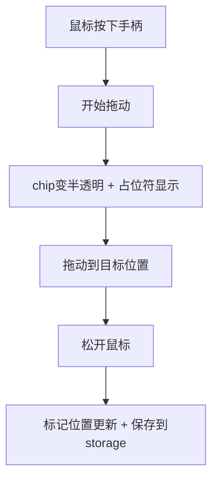
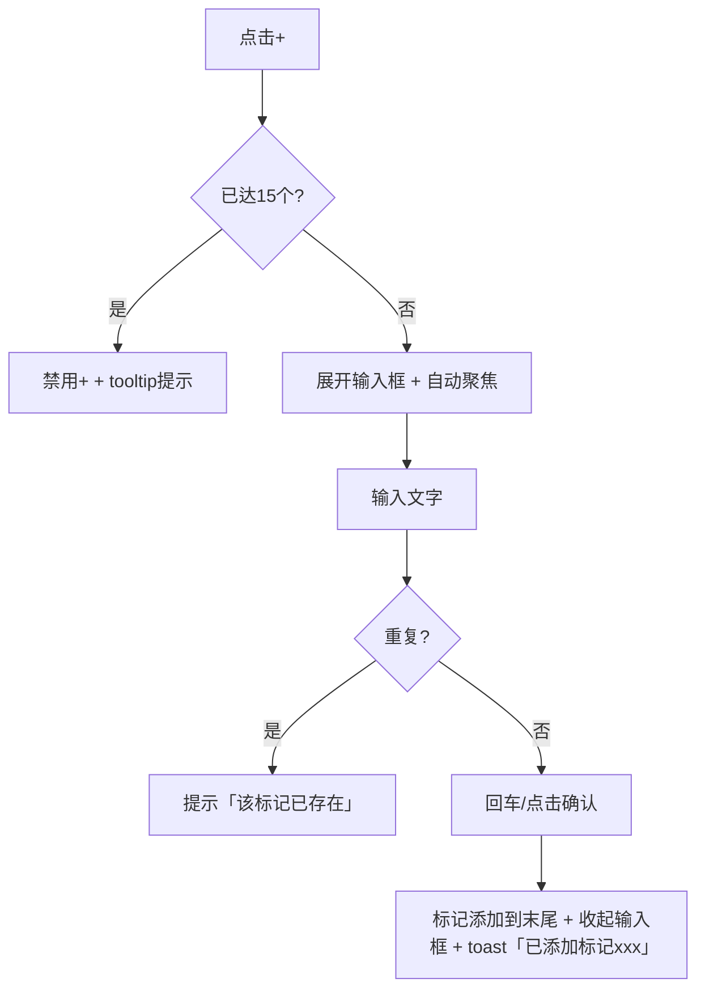
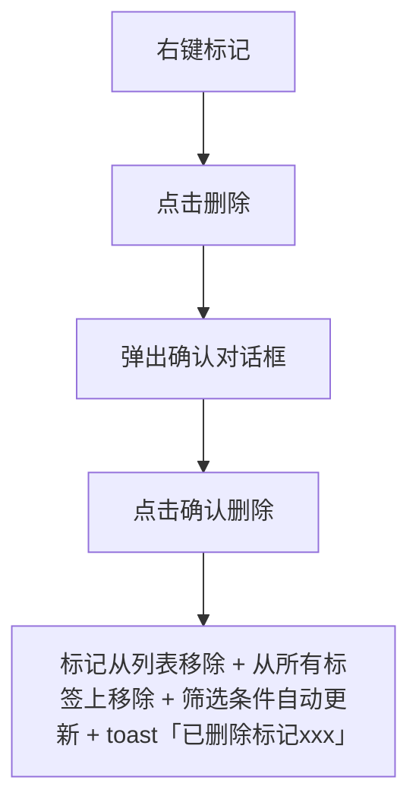
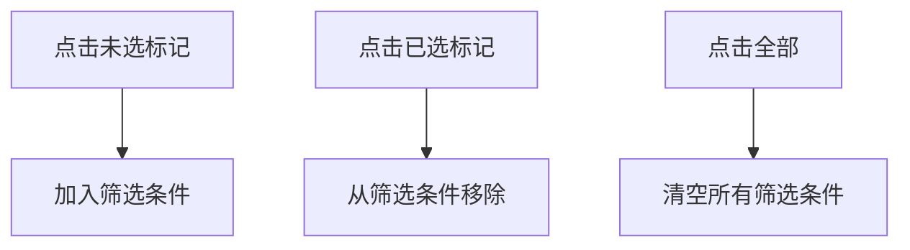

# 标记功能优化

> Status: Draft · Author: product-manager · Date: 2026-07-01

---

## 1. 背景与目标

### 现状/痛点

1. **标记容器体验差**：
   - 当前标记栏用宽度估算来决定显示多少个，超出的折叠到「更多(N)」
   - 标记多了需要点开浮层才能看到，操作路径长
   - 用户反馈「显示10个太小，容器太小」「多个标记没有滑动」

2. **缺少标记排序功能**：
   - 当前标记按添加顺序显示，无法调整
   - 重要标记可能排在后面看不见

3. **缺少数量限制**：
   - 当前可以无限添加标记，没有上限
   - 标记过多会让筛选功能失效（交集条件太严）

4. **缺少使用引导**：
   - 新用户不知道标记是干什么的、怎么用
   - 缺少问号说明

5. **编辑/删除入口深**：
   - 当前需要点「更多」→ 浮层内 hover 才显示编辑/删除按钮
   - 操作路径长

### 目标

- **容器优化**：标记栏支持横向滚动，显示更多标记，减少折叠
- **可排序**：支持拖动调整标记顺序
- **数量限制**：最多15个标记，达到上限时禁止添加
- **更好的可感知性**：
  - 操作前：清楚的提示（上限/字数限制）
  - 操作中：拖动视觉反馈
  - 操作后：完成提示 + 撤销路径（删除标记时）
- **引导说明**：标记栏加问号图标，hover 说明用法
- **不重做**：保留现有的交集筛选逻辑、TagPicker（卡片内的标记选择器）不动

### 成功指标

- 用户添加标记的操作路径不超过2步（直接在标记栏添加）
- 标记排序操作直观（拖动手柄就能排）
- 达到15个上限时用户能清楚知道为什么不能加了

---

## 2. 用户场景与故事

### 用户画像

- **重度用户**：有10+个标记，需要频繁调整顺序、筛选
- **轻度用户**：有3-5个标记，主要用筛选功能
- **新用户**：还不知道标记功能怎么用

### 用户故事

| ID | 作为 | 我想要 | 以便 | 优先级 |
|----|------|--------|------|--------|
| S1 | 重度用户 | 拖动调整标记顺序 | 把常用的标记放在前面 | P0 |
| S2 | 所有用户 | 在标记栏直接看到更多标记 | 不用点「更多」就能选 | P0 |
| S3 | 所有用户 | 添加标记时知道上限和字数限制 | 不会白输入半天 | P0 |
| S4 | 新用户 | 看到问号说明 | 知道标记是干什么的、怎么用 | P1 |
| S5 | 所有用户 | 删除标记时知道会发生什么 | 不会误删后悔 | P1 |

### 关键路径

- **添加标记**：点击「+」→ 输入 → 回车确认
- **筛选标记**：点击标记 → 再点取消；点多个 = 交集
- **排序标记**：拖动手柄 → 放到目标位置
- **编辑标记**：右键标记 → 选择「编辑」→ 修改
- **删除标记**：右键标记 → 选择「删除」→ 确认

---

## 3. 竞品参考

### Toby（知名标签管理插件）

- 标记栏：横向滚动，不折叠
- 排序：拖动标记整体（没有单独手柄）
- 添加入口：在标记栏右侧有「+」按钮
- 优点：滚动比折叠直观；缺点：拖动整个标记容易误触筛选

### Workona

- 标记栏：多行显示（最多2行），超出折叠
- 排序：右键菜单「移到前面」「移到后面」
- 优点：多行显示省空间；缺点：排序不够直观

### 我们的差异化

- **手柄+点击分离**：左侧拖动手柄，右侧点击筛选，互不干扰
- **横向滚动+不折叠**：所有标记都在栏上，直接点
- **右键快捷操作**：右键直接编辑/删除，不用进浮层

---

## 4. 交互设计

### A. 信息架构

标记栏保持在原位置（搜索框下方、工具栏上方），结构调整为：

```
[全部] [标记1][标记2][标记3][标记4] ... [+] [?]
```

- 「全部」按钮：左侧固定，用于清除所有筛选
- 标记列表：中间可横向滚动区域，每个标记有「手柄 | 名称 | 计数 | 关闭(选中态)」
- 「+」按钮：右侧固定，添加新标记
- 「?」按钮：右侧固定，查看说明

### B. 关键画面

#### 1) 标记栏布局

```
┌───────────────────────────────────────────────────────────────────┐
│ [全部] [⠿ 工作 ● 5] [⠿ 学习 ● 3] [⠿ 待办 ● 8] ... [+] [?] │
└───────────────────────────────────────────────────────────────────┘
       ↑                    ↑              ↑        ↑    ↑
    全部按钮          标记chip      横向滚动  添加  帮助
```

- 「⠿」= 拖动手柄（GripVertical 图标），hover 时显示光标为 grab
- 「● 5」= 该标记下的标签数量
- 选中态：`bg-blue-600 text-white`，右侧出现「×」按钮可移除该筛选
- 未选中态：`border-gray-200 text-gray-600 hover:bg-gray-50`

#### 2) 标记chip结构（未选中）

```
┌─────────────────┐
│ ⠿ 工作 ● 5 │  ← hover 时显示编辑/删除提示 tooltip
└─────────────────┘
```

- 左侧：拖动区域（手柄图标，占chip高度100%）
- 中间：标记名称（超出字数截断显示tooltip）
- 右侧：计数

#### 3) 标记chip结构（选中）

```
┌───────────────────┐
│ ⠿ 工作 ● 5 × │  ← 点击 × 取消该筛选
└───────────────────┘
```

#### 4) 添加标记输入框

点击「+」后，在标记栏下方展开输入框：

```
┌───────────────────────────────────────────────────────────────────┐
│ [全部] [标记1] [标记2] ... [+] [?]                     │
├───────────────────────────────────────────────────────────────────┤
│ 标记名称: [_______________] [确认] [取消]   (0/15) │
└───────────────────────────────────────────────────────────────────┘
```

- 输入框：`maxlength=15`，placeholder「标记名称（最多15字）」
- 右侧：实时字数计数「0/15」
- 已达15个标记时：「+」按钮变灰，hover tooltip「已达15个标记上限，请删除旧标记再添加」

#### 5) 右键菜单

右键点击标记chip弹出：

```
┌─────────────────┐
│ 编辑...         │  ← 打开编辑对话框
│ 删除...         │  ← 打开确认对话框
└─────────────────┘
```

#### 6) 编辑标记对话框

```
┌─────────────────────┐
│ 编辑标记            │
│ 名称: [__________] │ (0/15)
│                     │
│     [取消] [确认]  │
└─────────────────────┘
```

#### 7) 删除标记确认对话框

```
┌─────────────────────────┐
│ 删除标记「工作」？      │
│                         │
│ 该标记将从12个标签上    │
│ 移除。此操作可撤销吗？   │
│ → 不可撤销，但标签不会  │
│   被删除。              │
│                         │
│     [取消] [确认删除]  │
└─────────────────────────┘
```

#### 8) 帮助说明（问号hover）

```
┌─────────────────────────────────┐
│ 标记是什么？                     │
│                                 │
│ 标记是给标签分类的自定义标签。   │
│                                 │
│ 怎么用？                        │
│ • 点击「+」添加标记             │
│ • 点击标记筛选标签（多选=交集） │
│ • 拖动左侧手柄调整顺序          │
│ • 右键标记可编辑/删除           │
│ • 点击「全部」清除筛选          │
│                                 │
│ 提示：最多15个标记，每个最多15字│
└─────────────────────────────────┘
```

### C. 交互流

#### 1) 拖动排序流程



**可感知设计**：
- **事前**：手柄hover显示「拖动排序」tooltip
- **事中**：拖动时chip变半透明，目标位置显示占位符（蓝框）
- **事后**：位置立即更新，无额外提示（操作结果直观可见）

#### 2) 添加标记流程



**可感知设计**：
- **事前**：+按钮hover显示「添加标记（最多15个）」tooltip
- **事中**：输入框实时字数计数，重复时输入框边框变红
- **事后**：toast提示「已添加标记xxx」

#### 3) 删除标记流程



**可感知设计**：
- **事前**：删除菜单项文字为「删除...」（带省略号表示需要确认）
- **事中**：确认对话框清楚说明后果（从多少个标签上移除、能否撤销）
- **事后**：toast提示「已删除标记xxx」

#### 4) 筛选交互（现有逻辑，保持不变）



**已实现的可感知设计**：
- 选中态/未选中态视觉区分明显
- 已选标记右侧有「×」按钮可快速移除

### D. 边界状态

#### 1) 空状态（无标记）

```
┌───────────────────────────────────────────────────┐
│      [+] 添加标记来分类标签        [?]      │
└───────────────────────────────────────────────────┘
```

#### 2) 达到15个标记上限

- 「+」按钮变灰，hover tooltip「已达15个标记上限，请删除旧标记再添加」
- 右键菜单仍可删除/编辑

#### 3) 标记名超长（15字）

- 输入时达到15字禁止继续输入
- 显示时超出部分截断，hover显示完整名称

#### 4) 删除正在用于筛选的标记

- 删除后该筛选条件自动从 `activeTagFilters` 移除
- 列表立即更新

#### 5) 拖动到自身位置

- 无变化，不需要提示

### E. 引导/教育

- 首次进入时：问号图标用蓝色高亮（P1，可选）
- 问号hover：显示完整帮助说明（见上文关键画面8）

---

## 5. 数据模型

### 实体定义

- **`customTags`**（现有）：`string[]` —— 标记名称数组，顺序即显示顺序
  - 变更：新增时 push 到末尾；拖动时调整数组元素位置
  - 存储位置：`chrome.storage.local`

- **`tabTagsMap`**（现有）：`Record<string, string[]>` —— tabId → tags
  - 变更：删除标记时，从所有标签的 tags 数组中移除该标记
  - 存储位置：`chrome.storage.local`

### 新增方法（useTabManager）

```typescript
// 重新排序标记
reorderCustomTags(fromIndex: number, toIndex: number): Promise<void>
```

### 现有方法调整

- **`addCustomTag`**：添加前检查 `customTags.length < 15`，已达上限时返回错误
- **`removeCustomTag`**：删除后自动从 `activeTagFilters` 移除该标记（如果存在）
- **`renameCustomTag`**：重命名后自动更新 `activeTagFilters` 中的标记名（如果存在）

---

## 6. 接口契约

本功能全在前端实现，无后端接口。

---

## 7. 性能/安全/兼容

### 性能

- 标记排序操作：只更新 `customTags` 数组并写 storage，不触发全量重渲染
- 横向滚动：使用原生 `overflow-x: auto`，性能最优
- 上限15个：保证标记栏不会有性能问题

### 安全

- 输入框：已有 `maxlength=15`，防止注入
- 删除操作：二次确认，防止误删
- 存储：继续使用 `chrome.storage.local`，不需要加密

### 兼容

- Chrome/Edge 均支持拖动（原生 Drag API）
- 旧版本降级：拖动不可用时可右键「移到前面」「移到后面」（P2，可选）
- 暗色模式：支持现有 `dark:` 类

---

## 8. 验收标准

### 功能验收

| ID | 场景 | 验收条件 | 优先级 |
|----|------|----------|--------|
| A1 | 添加标记 | 最多15个，达到上限时+按钮禁用并提示 | P0 |
| A2 | 添加标记 | 每个标记最多15字，重复时提示 | P0 |
| A3 | 拖动排序 | 拖动手柄可调整顺序，新增标记在末尾 | P0 |
| A4 | 点击筛选 | 点击标记筛选，再点取消，多选交集（现有逻辑不重做） | P0 |
| A5 | 标记栏容器 | 支持横向滚动，不折叠到更多 | P0 |
| A6 | 问号说明 | 问号存在，hover显示用法说明 | P0 |
| A7 | 编辑标记 | 右键可编辑，重命名后标签上的标记同步更新 | P1 |
| A8 | 删除标记 | 右键可删除，确认后标记从列表和所有标签上移除 | P1 |
| A9 | 删除筛选中 | 删除正在用于筛选的标记，筛选条件自动更新 | P1 |
| A10 | 全部按钮 | 点击全部清除所有筛选 | P0 |

### 性能验收

- 标记栏滚动60fps
- 拖动排序响应时间<50ms
- 筛选响应时间<100ms

### 兼容验收

- Chrome 100+ 正常工作
- Edge 100+ 正常工作
- 暗色模式显示正常
- 小面板（宽度<300px）下滚动正常

---

## 9. Non-Goals（明确不做）

- ❌ 不重做交集筛选逻辑（现有逻辑保持不变）
- ❌ 不修改 TagPicker（卡片内的标记选择器）
- ❌ 不做标记颜色/图标自定义
- ❌ 不做标记分组（标记的分组）
- ❌ 不做标记云端同步
- ❌ 不做撤销删除（删除操作不可撤销，但标签不会被删）
- ❌ 不做拖动排序的右键备选方案（P2，未来可能加）

---

## 10. 风险与未决问题

### 已知风险

| 风险 | 影响 | 概率 | 缓解措施 |
|------|------|------|----------|
| 拖动与点击冲突 | 用户想点击筛选但误触发拖动 | 中 | 手柄与点击区域分离：只有拖动手柄能拖动，点击chip主体是筛选 |
| 15个上限用户不习惯 | 用户习惯无限添加 | 低 | 清楚的提示（问号说明、上限时tooltip） |
| 横向滚动在某些设备上不明显 | 用户不知道可以滚动 | 低 | 标记溢出时显示滚动条（或用阴影暗示还有内容） |

### 未决问题

- > **@TODO**：是否需要「恢复默认顺序」功能？（当前决策：不需要，MVP先不加）
- > **@TODO**：是否需要在标记栏显示管理按钮（替代现有「更多」浮层）？（当前决策：不需要，右键已覆盖）

---

## 附录：与现有代码的联动点

根据 `docs/code-map.md`，本功能改动涉及：

1. **修改组件**：
   - `components/TagBar.vue` —— 重构（可滚动、拖动、手柄、+、?）
   - `components/TagFilterPanel.vue` —— 可能简化或移除（如果不再需要「更多」）
   - `components/TagPicker.vue` —— **不动**

2. **修改 composable**：
   - `composables/useTabManager.ts` —— 加 `reorderCustomTag`，调整 `add/remove/rename` 加限制

3. **修改 sidepanel**：
   - `sidepanel.vue` —— 调整 TagBar 的 props/events

4. **不需要**加新 storage key（用现有的 `customTags`/`tabTagsMap`）
5. **不需要**改 StoragePanel（现有的键已登记）
